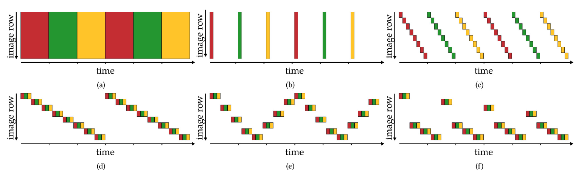

Let's talk about Achar et al.'s paper "Epipolar Time-of-Flight Imaging". This relates to my MSCV capstone project "Neural Synthetic Wavelength Interferometry" in that this method and our method both use continuous-wave Time-of-Flight (CW-ToF) sensors. This paper notes CW-ToF sensor's shortcomings and tries to improve it. In my capstone project, we improve on it by applying neural networks to some parts of the pipeline. 

### What this paper does well

E
The author provide a well explained and useful comparison between epipolar planes' sampling orders for each scenario. For example,  

### Some problems

### Questions and Exploration
