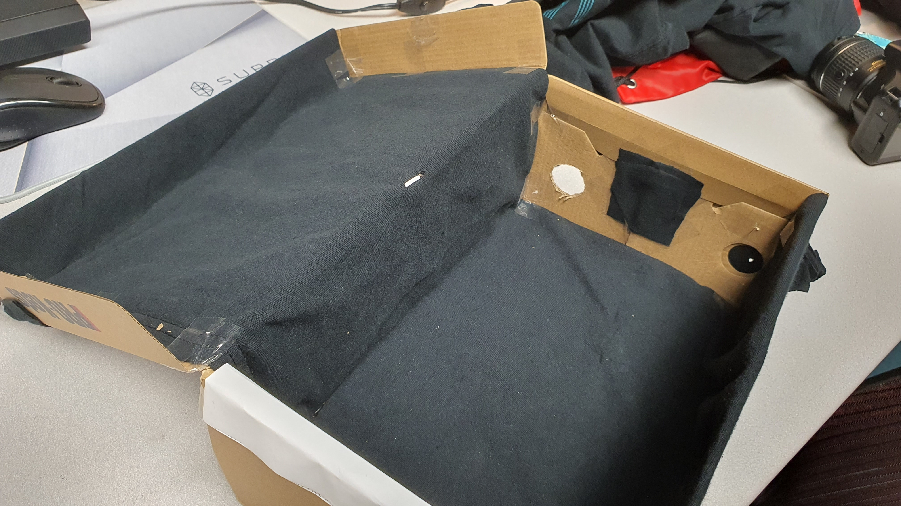
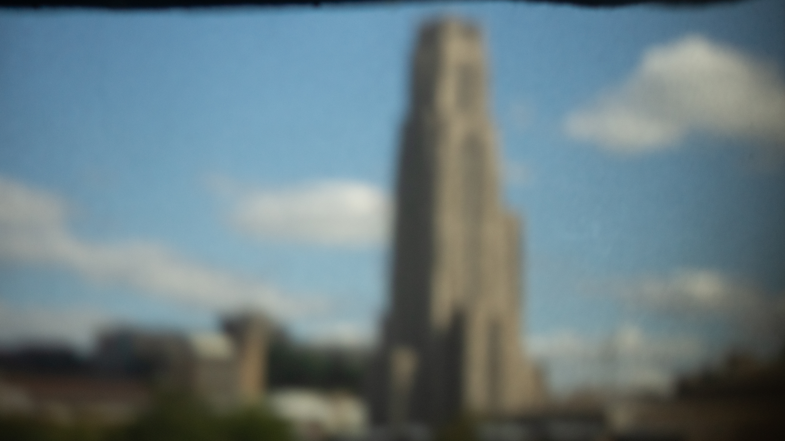
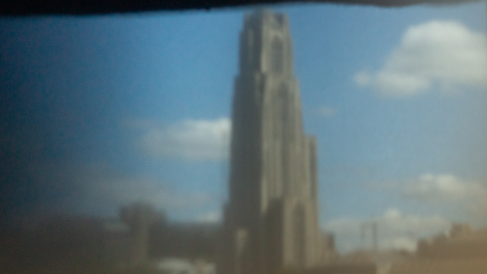
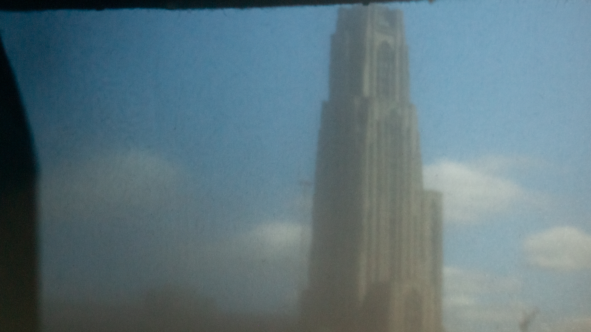
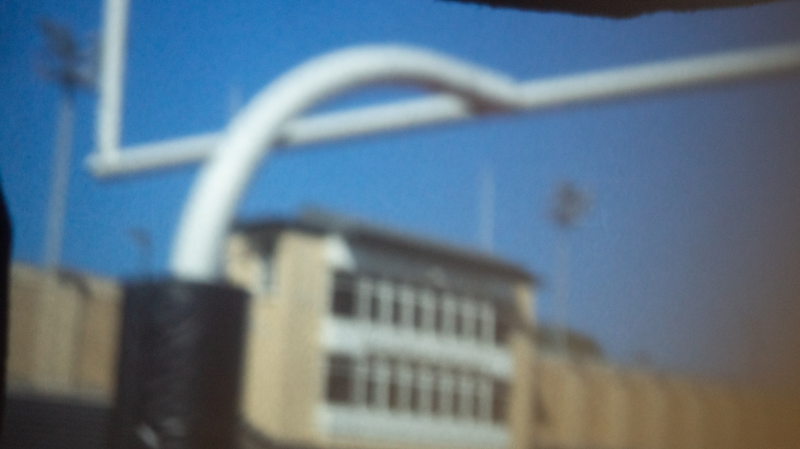
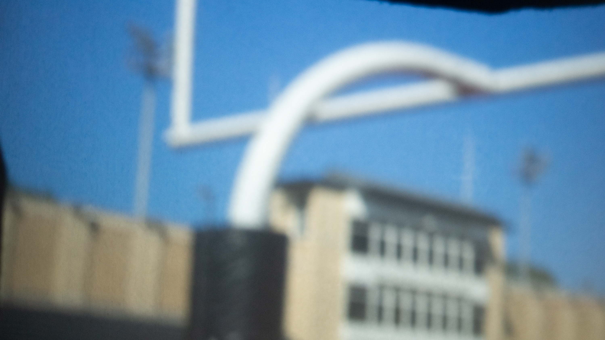
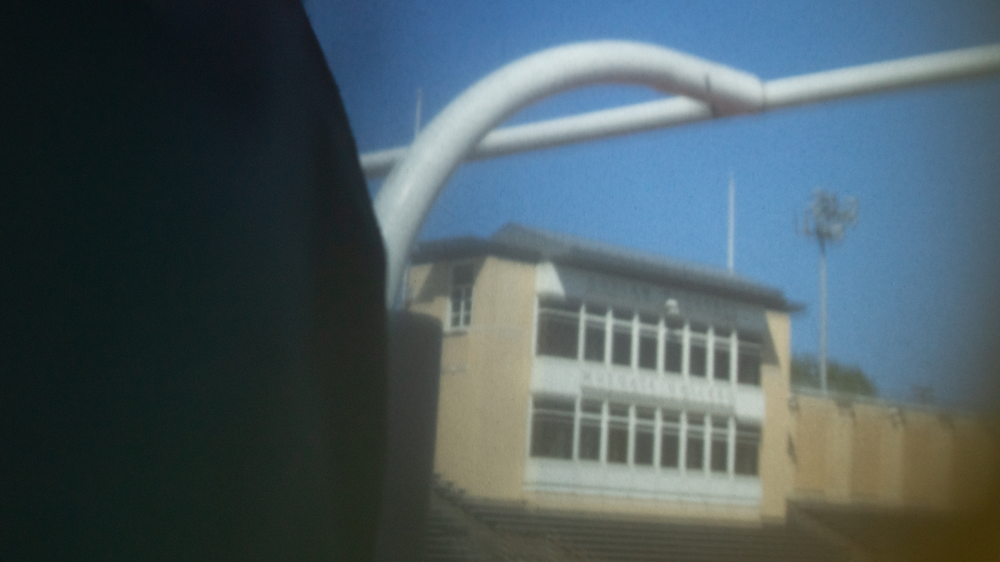
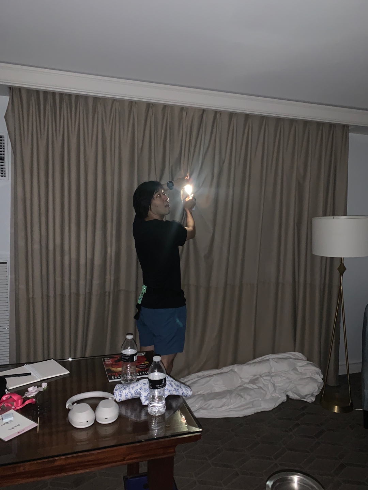

<!-- excerpt_separator -->


## Building the pinhole camera 	

```
Screen size = 12.5cm x 20.5cm
Focal length = 32cm
Horizontal FoV = 35.52 degrees
Vertical FoV = 22.1 degrees
Diagonal FoV = 41.11 degrees
```
This FoV is similar to that of a 50mm lens on a full-frame camera.





					
## Using my pinhole camera	
For the four pinhole diameters I tested, the following were the usual shutter speeds at ISO 640, although it was a non-scientific approach with varying settings for each scene and shot. 

| pinhole diameters    | shutters speed    |
|---------------- | --------------- | 
| 25mm    | 1/45    | 
| 5mm    | 8”    | 
| 3mm    | 15”    | 
| <0.5mm    | >30”    | 


The 2.5cm diameter pinhole was useful for framing the shot because it let in a lot of light and could be seen easily with bare eyes and shot quickly.

As the pinhole diameter gets smaller, the sharper and darker the image gets. Using bulb exposure mode I believed I could make the small infinitely smaller at the mechanical level. However, at extreme degrees this was not the case.

I could not achieve meaningful images a pinhole diameter smaller than 1mm because at that point there were similar levels of light seeping through the camera lens hole. I did not want to use duct tape in order to allow portability and full adjustability inbetween shots. Instead, I tried to cover the system with a black tshirt a la focusing hoods. Even then, I could not fully block all light without using tape.










## Camera obscura in my room

During my stay at a hotel in LA, I made use of the high quality black out curtains. I hung bedsheets on the wall opposite to the windows to act as a screen. I blocked out any additional light seeping through the curtains with other clothing. Then I opened a 15cm hole to act as a pinhole.

<figure>
	
	<figcaption>
		photo of the room.
	</figcaption>
</figure>
<figure>
	
	<figcaption>
		a photo of the scene taken directly with a digital camera.
	</figcaption>
</figure>
<figure>
	
	<figcaption>
		a long exposure photo of the image projected on the screen.
	</figcaption>
</figure>
