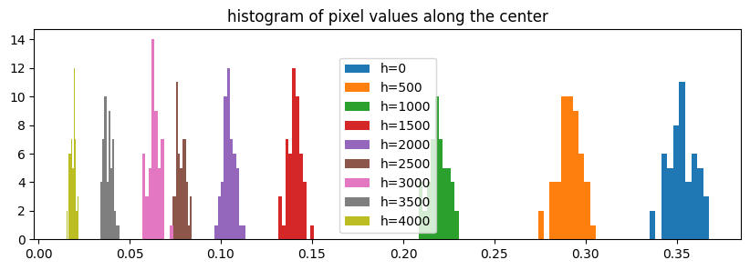

### 1.1 `dcraw`

First I check to see that `dcraw` works with Sony's ARW format. You can see possible options [here](https://www.dechifro.org/dcraw/dcraw.1.htmls), but the following is what I used.

```sh
./dcraw -a -b 1.69 -g 2.4 12.92 -o 1 -q 0 -T -4 data/own/DSC02659.ARW
```

### 1.2 Linearizing JPG

<figure>
    
    <figcaption>
        Linearizing JPG images using a function $$g=\text{log}(f^{-1})$$
    </figcaption>
</figure>

### 1.3 Weighting schemes
I used values of $$Z_{\text{min}}=0.02$$ and $$Z_{\text{max}} = 0.95$$ to discard potentially clipped values.

### 1.4 Merge exposure stack to HDR image

After trying out multiple options in {JPG, RAW} sources x {linear, logarithmic} merging schemes x {uniform, tent, gaussian, photon} weighting schemes, my favourite is either **linear or logarithmic** merging using **photon** weighting using **RAW** sources. However, I note that while the RAW vs JPG source was the cause of a lot of variance in the output, merging schemes and weighting schemes were not.
<figure>
    
    
    
    <figcaption>
        First: HDR from RAW brightness controlled for bright areas. <br>
        Second: HDR from RAW brightness controlled for dark areas. <br>
        Third: HDR from JPG brightness controlled for dark areas. <br>
    </figcaption>
</figure>


## 2. Color correction and white balancing
<figure>
    
    
    
    <figcaption>
    Above: Before color correction and WB
    </figcaption>
</figure>
<figure>
    
    
    
    <figcaption>
    Above: After color correction and WB
    </figcaption>
</figure>
I personally prefer the image that has not been color corrected. 
The colors seem much more saturated in the image after color correction and white balancing.
A lot of the detail in the scene is in the bright hallway while the colorchecker is inside the room, where there are probably different light profiles. This could be the cause of why the hallway looks worse after color correction and white balancing. 


## 3. Tonemapping

Here I list my favourite tonemap settings, after color correction, white balancing, tonemapping, gamma encoding.


#### RGB tonemapped

<figure>
    
    <figcaption>
    Above: RGB tonemapped image with B=0.800 K=0.019
    </figcaption>
</figure>

- B=0.700 K=0.019
- B=0.750 K=0.022
- B=0.800 K=0.019
- B=0.850 K=0.044
- B=0.900 K=0.053


#### Y tonemapped


<figure>
    
    <figcaption>
    Above: Y tonemapped image with B=0.800 K=0.031, which is my favourite out of all of them.
    </figcaption>
</figure>


- B=0.700 K=0.053
- B=0.750 K=0.037
- B=0.800 K=0.031
- B=0.850 K=0.022
- B=0.900 K=0.026


## 4. Developing my own HDR images

### GHC

<figure>
    
    
    
    <figcaption>
    First: Luminance-tonemapped HDR image with B=0.800 K=0.088<br>
    Second: LDR image exposed for bright area<br>
    Third: LDR image exposed for dark area
    </figcaption>
</figure>


## 5 Noise calibration and optimal weights
We want to improve our method by getting rid of dark noise from RAW images and accounting for additive noise when weighting the bracketed exposure images.  

### 5.1 Noise Calibration

The darkframes and ramp images were shot on Sony A77 at ISO 200, shutter speed 1/45 seconds, and aperture f/3.5.


#### Ramp image


<figure>
    
    
    
    <figcaption>
    First: Digital ramp image <br>
    Second: Pictured ramp image <br>
    Third: histogram of pixel values along a vertical line in the center
    </figcaption>
</figure>


#### Mean vs Variance

In order to estimate the gain and read noise, 
we plot the variance of pixels that share the same mean value.
Seeing that the higher half of mean values, dominated by poisson noise, has a lot of outliers and the lowest few values have outliers too.
We calculate the gain and additive noise discounting the outliers.

<figure>
    
    
    
    <figcaption>
    First: Mean vs variance of 1% of data <br>
    Second: Mean vs variance using 1% of data, with up to value = 3000 <br>
    Third: All data within range 1000-12,000
    </figcaption>
</figure>


$$E(I) = t \cdot (a \cdot \Phi ) \cdot g$$

$$\sigma(I)^2 = t \cdot (a \cdot \Phi ) \cdot g^2 + \sigma^2_{\text{add}}$$

$$\sigma(I)^2 = E(I) \cdot g + \sigma^2_{\text{add}}$$

Here, the coefficient represents gain (g = k * ISO) from the analog amplifier and intercept represents the combined additive noise from analog amplifier and analog-to-digital converter (ADC).

Upon applying linear regression on the per-pixel mean values in the range [1000, 12000], which leaves out the outliers in the lower and upper ends, we estimate the following gain and additive noise values:

$$\begin{align*}
g_R =& 47.8 \\ 
g_G =& 23.2 \\
g_B =& 26.2 \\
\sigma^2_{\text{add}}(R) =& 10,200 \\
\sigma^2_{\text{add}}(G) =& 2,860 \\
\sigma^2_{\text{add}}(B) =& 8,630 \\
\end{align*}$$


#### Optimal weights
Now we use this knowledge to construct an "optimal" weighting scheme. 
Here, we're optimizing to reduce variance. 
Using optimal weights, we get the following image:


Frankly, it is hard to see noticeable differences in the two images, one produced using photon weights and one with optimal weights.

<!-- MathJax library for rendering LaTeX -->
<!-- example usage: $$\tilde{\theta}$$  -->
<script src="https://polyfill.io/v3/polyfill.min.js?features=es6"></script>
<script id="MathJax-script" async src="https://cdn.jsdelivr.net/npm/mathjax@3/es5/tex-mml-chtml.js"></script>
