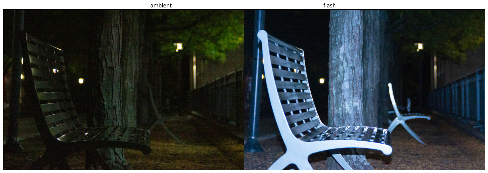
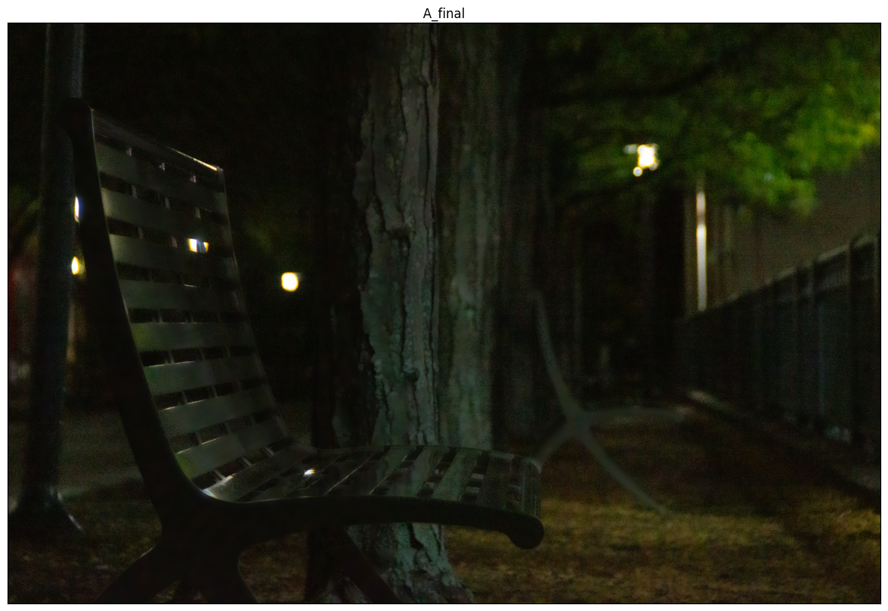
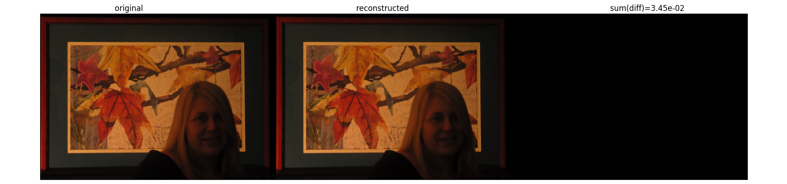
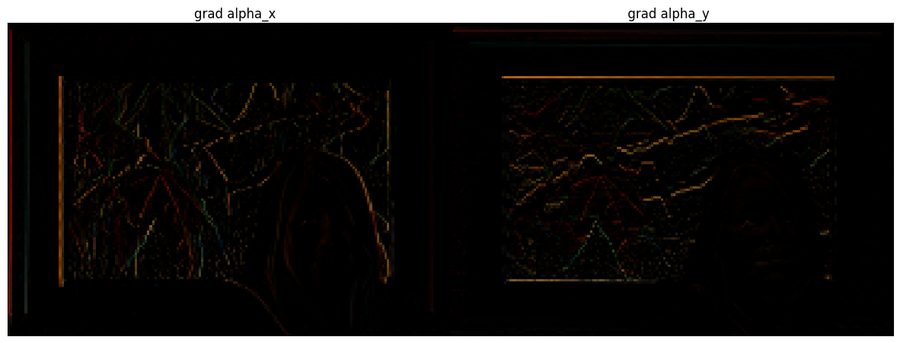
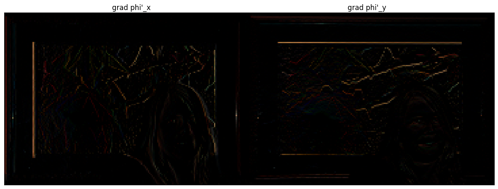
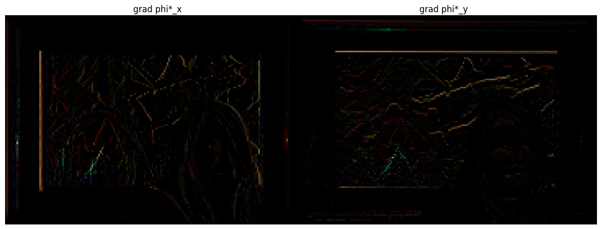
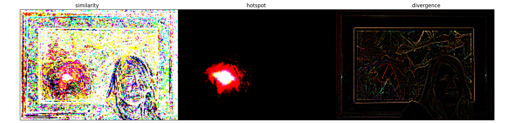
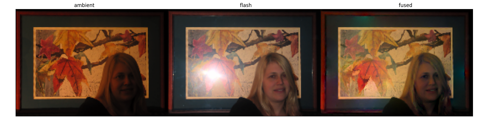
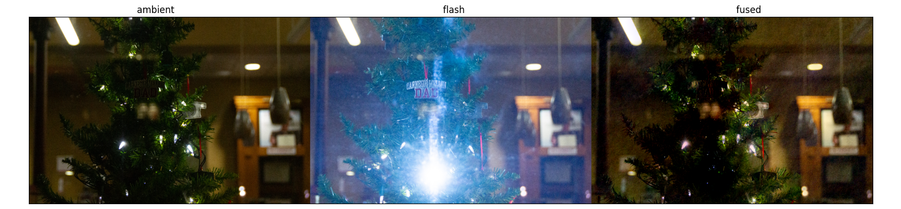

## Bilateral Filter
spatial: 4, intensity: 0.15

- Advantage: works with a single photo
- Disadvantage: to reduce noise, must sacrifice detail in other regions too

<!-- Here is a simple footnote[^1]. With some additional text after it. -->

<!-- [^1]: My reference. -->

<!-- ## How gaussian filter can be sped up using FFT -->

<!-- ## How bilateral filter can be sped up using bilateral grid -->

## Joint Bilateral Filter
spatial: 3, intensity: 0.1

- Advantage: Can use the less noisy area of the flash image as guidance.
- Disadvantage: Must take two images very well aligned.

## Detail transfer
Settings for F_base:
spatial: 4, intensity: 0.15

- Advantage: The detail that was lost in joint bilateral filter has come back.
- Disadvantage: requires running the bilateral filter three times.

## Shadow and specularity masking
tau_shadow: 0.1, tau_specular: 0.85

- Advantage: finetunes which source to use for each area of the image. 
- Disadvantage: Not a noticeably big difference if specularities don't exist a lot.

## Bilateral filtering on my own image

## Differentiate and re-integration of image

<!-- ## Conjugate Gradient Method -->

## Fused gradient field
I found $$\sigma=35, \tau_s=0.85$$ to give desirable results.

### Gradient field $$\nabla \alpha$$

### Gradient field $$\nabla \phi^\prime$$

### Gradient field $$\nabla \phi^\star$$

### Weights

### Final fused image
Different initializations did not effect the outcome image that much, but the boundary conditions do. I found the average of the ambient and flash image to give best results.

## Gradient domain fusion on my own images

<!-- MathJax library for rendering LaTeX -->
<!-- example usage: $$$\tilde{\theta}$$$  -->

