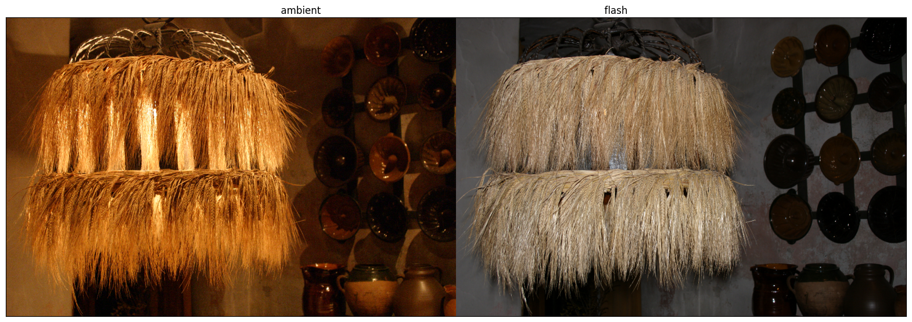
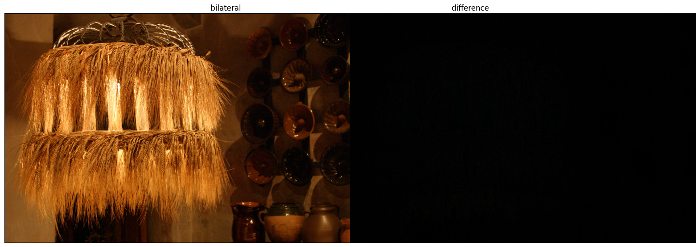
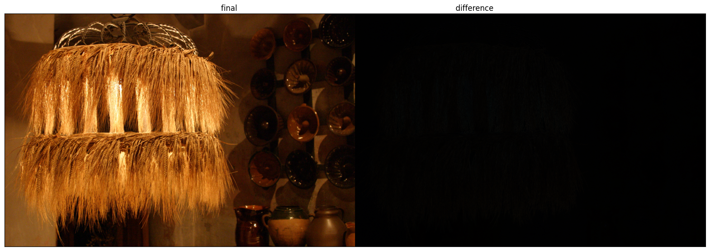

## Bilateral Filter
spatial: 4, intensity: 0.15

- Advantage: works with a single photo
- Disadvantage: to reduce noise, must sacrifice detail in other regions too

<!-- Here is a simple footnote[^1]. With some additional text after it. -->

<!-- [^1]: My reference. -->

<!-- ## How gaussian filter can be sped up using FFT -->

<!-- ## How bilateral filter can be sped up using bilateral grid -->

## Joint Bilateral Filter
spatial: 3, intensity: 0.1

- Advantage: 
- Disadvantage: 

## Detail transfer
Settings for F_base:
spatial: 4, intensity: 0.15

- Advantage: 
- Disadvantage: 

## Shadow and specularity masking
tau_shadow: 0.1, tau_specular: 0.85

- Advantage: 
- Disadvantage: 

In general, the best parameters will be different for each of the four types of filtering you will implement: 
- basic bilateral filtering, 
- joint bilateral filtering, 
- denoising with detail transfer, and 
- mask-based merging. 

In your report, compare the results of the four algorithms for different sets of parameter values. For these comparisons, make sure to show difference images image1 − image2, which should help highlight where in the images the techniques perform differently. Report the parameter values you chose as best for the four types of filtering, and discuss the advantages and disadvantages of each type.

named as competition entry.png.