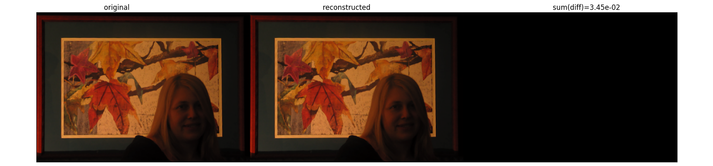
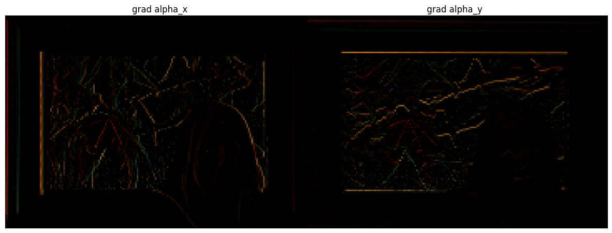
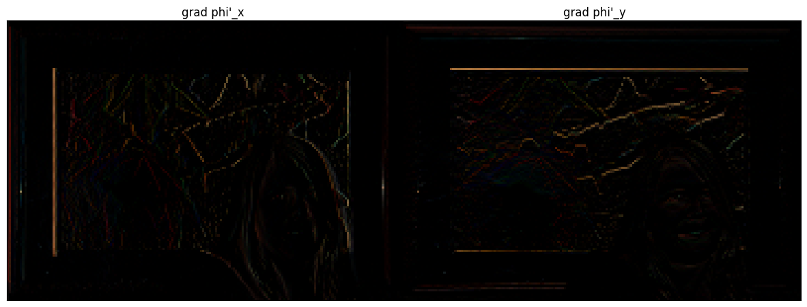
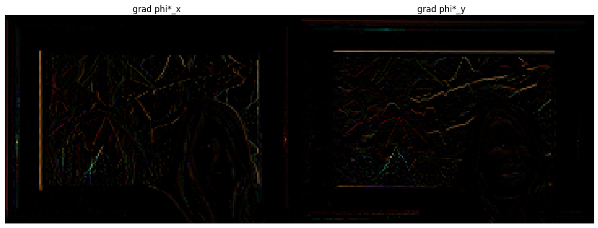
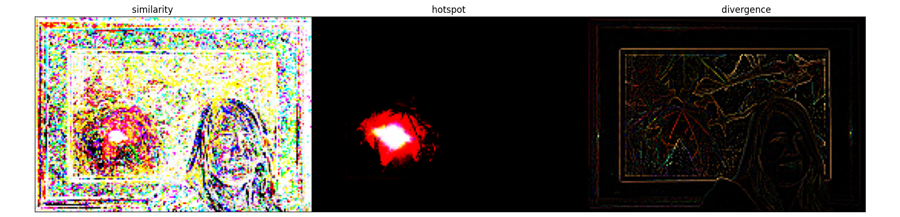
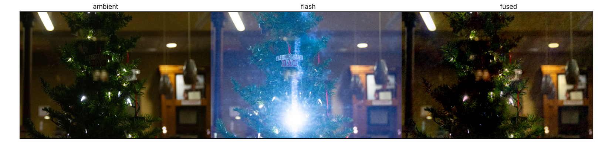

## Differentiate and re-integration of image

<!-- ## Conjugate Gradient Method -->

## Fused gradient field
I found $$\sigma=35, \tau_s=0.85$$ to give desirable results.

### Gradient field $$\nabla \alpha$$

### Gradient field $$\nabla \phi^\prime$$

### Gradient field $$\nabla \phi^\star$$

### Weights

### Final fused image
Different initializations did not effect the outcome image that much, but the boundary conditions do. I found the average of the ambient and flash image to give best results.

## Gradient domain fusion on my own images

<!-- MathJax library for rendering LaTeX -->
<!-- example usage: $$$\tilde{\theta}$$$  -->

