<!-- View this page on [my blog]({{ site.base_url }}/lightfield) for moving GIFs. -->
View this page on [my blog](https://simonseo.blog/lightfield) for moving GIFs.

##1. Plenoptic image
The plenoptic image is restructured as a matrix of size $$(U, V, S, T, C) = (16, 16, 700, 400, 3)$$.
- $$U, V$$ are the coordinates on the aperture or coordinates of the pinhole, viewpoint, or the origin of a light ray.
- $$S, T$$ are the the coordinates on the lenslet array or the coordinates of the coordinates of the world object for a fixed pinhole, or the endpoint of a light ray. 

### Sub-aperture views
This data has 16x16 "viewpoints" or sub-apertures. Each viewpoint is depicted here, in a grid of 16x16 images.

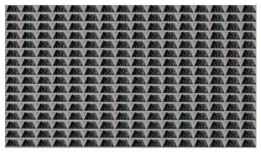{:width="1000px"}

### Refocusing / Focal stack simulation

<!-- \[ \int_{a}^{b} x^2 \,dx \] -->
$$\iint_{(u,v) \in A} L(u, v, s, t, c) \text{d}v \text{d}u$$
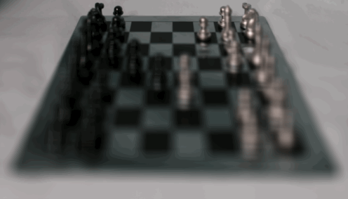

### Depth from focus
Using $$\sigma_1=1, \sigma_2=4$$, we recover the following depth image and all-in-focus image.
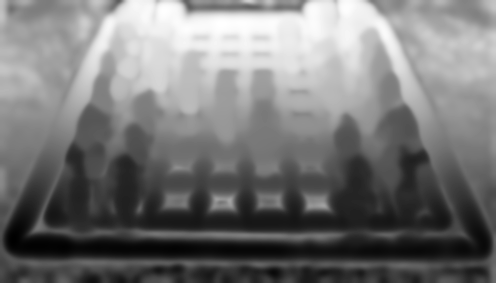
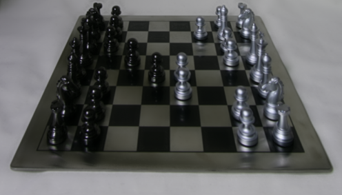

### Focus-Aperture stack

The aperture size varies horizontally and focal distance varies vertically along the grid in the following image.
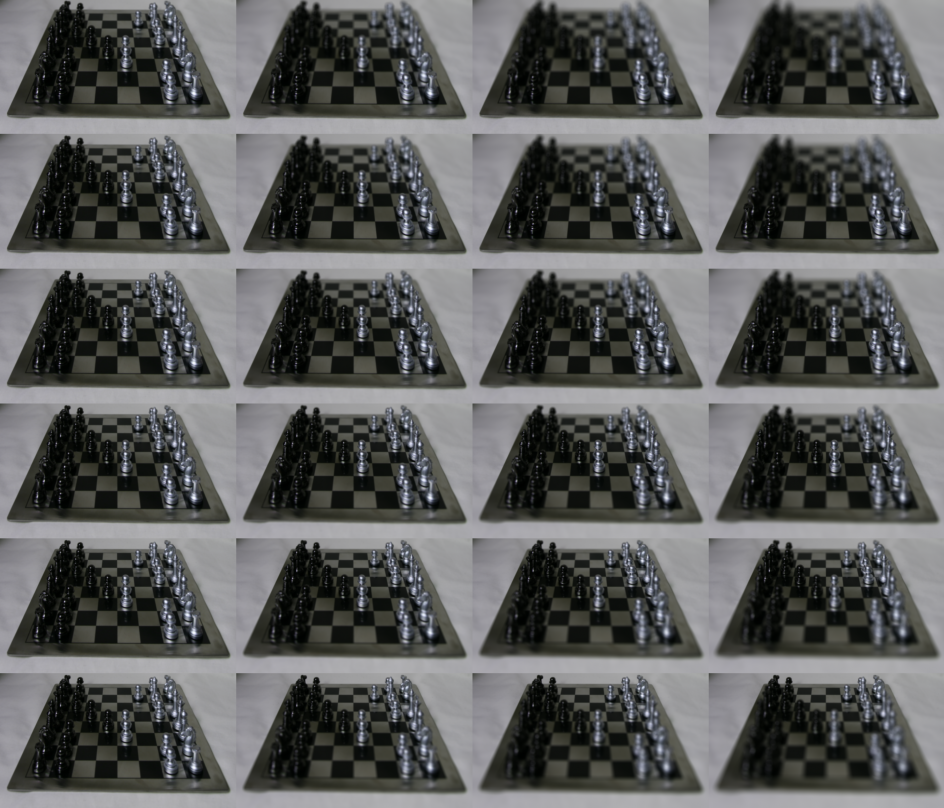

### Aperture-focus images
<figure>
    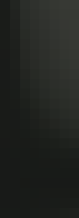
    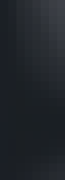
    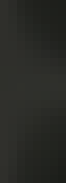
    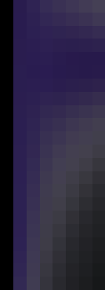
    <figcaption>
Aperture-focus image at the following pixel locations. From left:  
x=60, y=240  
x=90, y=360  
x=150, y=120  
x=200, y=125  
Horizontal axis represents aperture size and vertical axis represents change in depth.or focus
    </figcaption>
</figure>

### Depth from Focus-Aperture stack
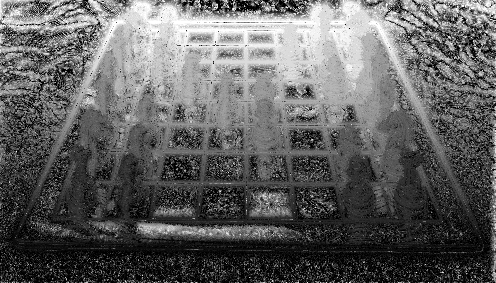

##1. Unstructured lightfield

### Capturing unstructured lightfield

<figure>
 
 

    <figcaption>
        Data used for unstructured lightfield.  
        Top: the full-length GIF shows how the camera was moved. 
        Bottom: three cuts from different heights.
    </figcaption>
</figure>

### Calculating shifts

<figure>

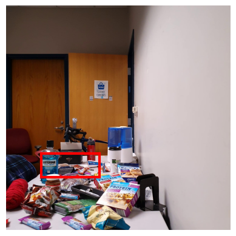
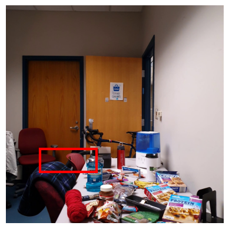
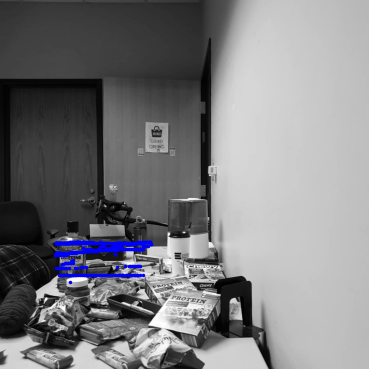
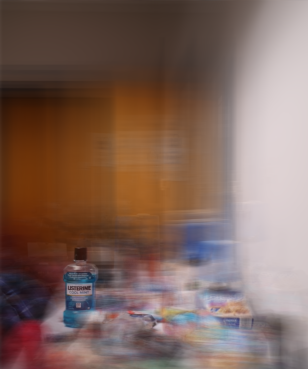
<figcaption>
Top Left: template patch 
Top Center: frame taken from bottom right camera position   
Top Right: frame taken from top left camera position  
The red box refers to the search window.  
Bottome Left: A plot of all points where the template patch was found. 
Bottom Right: A refocused image on the template 
</figcaption>
</figure>

1. I employ a coarse-to-fine search to save computation. I slide the template by `step_size` across the search window and find the position where NCC is highest.

1. When such initial position is found, I search within a smaller search window within `step_size` distance from the initial position by sliding the template by a single pixel at a time.

1. To calculate NCC (Normalized Cross Correlation), 
- center both template and image patch at zero mean.
- apply box filter on image patch
- divide by l2 norm
- take sum of correlation `scipy.signal.correlate2d`

1. The position found in step 2 offset by shifting the same amount in the negative direction, in order to align all the frames on the same patch.

1. Average all aligned frames and crop to attain the refocused image.

<figure>
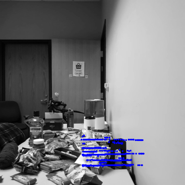
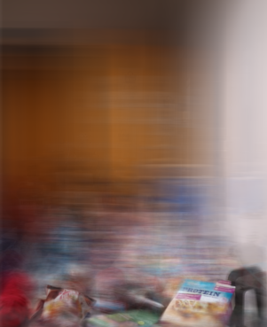
 
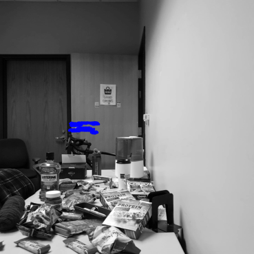
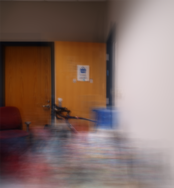
    <figcaption>
    Top: refocused on "protein" box  
    Bottom: refocused on door
    </figcaption>
</figure>

<!-- MathJax library for rendering LaTeX -->
<!-- example usage: $$$\tilde{\theta}$$$  -->

