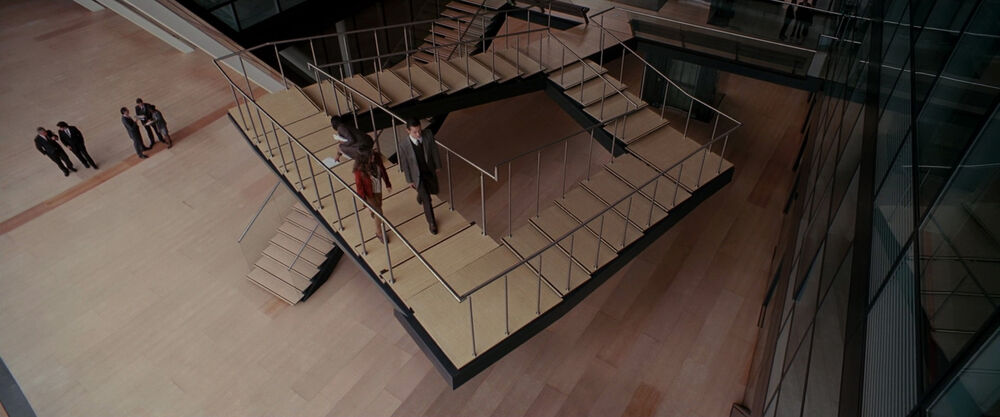
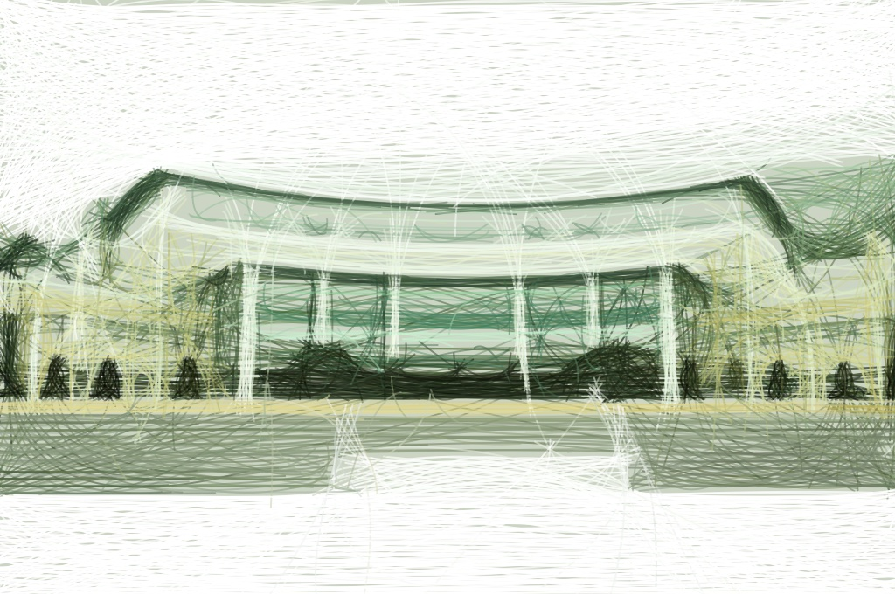

{:width="50"}

The question that opens a course at CMU. Perhaps the only thing I can figure out perfectly in this course. 

<!-- excerpt_separator -->

The first paragraph is not indented. The second paragraph and onwards are indented.


##1. Cool 3D shape
<figure>
  
  <figcaption>
    Penrose Stairs from Christopher Nolan's movie "Inception" (2010). 
    <br>
    Image source: <a href="https://inception.fandom.com/wiki/Penrose_stairs_(dream)">Inception Wiki</a>
  </figcaption>
</figure>

##1. Funny GIF
<figure>
  
  <figcaption>
    Meme based on video by Instagram user @thesadia <a href="https://www.instagram.com/p/-fNS5tSOHp">"I am confusion" (2015)</a> 
    <br>
    Image source: <a href="https://tenor.com/view/i-am-confusion-kansas-arkansas-map-usa-gif-10525591">tenor</a>
  </figcaption>
</figure>


##1. Et Cetera
This website theme is adapted from Hitcens theme by [patdryburgh](https://patdryburgh.com/). Photos below are mine though.

<figure>
  
  
  <figcaption>
    Top: Cheongshim International Acadmey. <br>
    Bottom: A dog lying in front of blue container. <br>
    Photos by myunggus.
  </figcaption>
</figure>


##1. Usage
We have code highlighting

```py
# python
class Example:
    def main(self):
      print("hello world!")
      return
```

And to produce a page like this we need the following folder structure:

```
_posts > whatever_folder_name > yyyy-mm-dd-projN.md
_posts > whatever_folder_name > data > whatever_local_files
```
where N is a number.

They only need a filename.
Permalink in the front-matter of post-title.md should be empty.
The date in the front-matter is what actually gets used.
