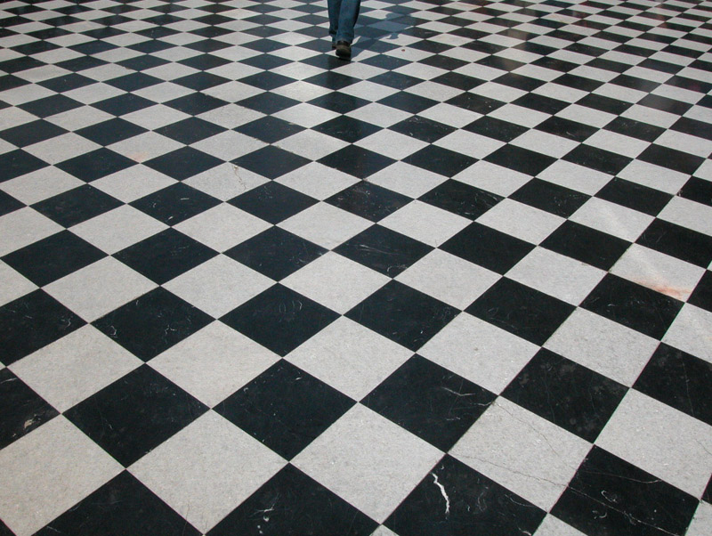

{:width="50"}

##1. Planar Homography first!

1. normalize corresponding points by scaling them to have a mean distance of $$\sqrt{2}$$ from the origin each

2. solve $$H\vec{x} \times \vec{x^\prime} = 0$$ since the two terms are "projectively equal" using the form $$[\vec{x^\prime}]^\top_\times \begin{bmatrix}x^\top & 0 & 0 \\  0 & x^\top & 0 \\ 0 & 0 & x^\top \\ \end{bmatrix} \vec{h} = \begin{bmatrix}0 & -w^\prime x^\top & y^\prime x^\top  \\ w^\prime x^\top & 0 & -x^\prime x^\top \\ \end{bmatrix} \vec{h} = 0$$

3. re-adjust the homography matrix $$\tilde{H}$$ with the normalization transformations, and use it to warp one image to the perspective of the other. Composite the two images

### Geoviz textbook

| Normal Image | Perspective Image | Annotated corners in Perspective Image | Warped and Overlaid Image |
| :-----------: | :-----------: | :-----------: | :-----------: |
|    |   |    |  |

### Geoviz lecture video

| Normal Image | Perspective Image | Annotated corners in Perspective Image | Warped and Overlaid Image |
| :-----------: | :-----------: | :-----------: | :-----------: |
|    |   |    |  |

##1. Affine rectification

1. Choose two pairs of should-be parallel lines.
1. for each, find the intersections $$v_1$$ and $$v_2$$. These are the images of the points at infinity in the original space
1. find the line $$l'$$ passing through $$v_1$$ and $$v_2$$. this is the should-be line at infinity
1. find $$H$$ s.t. $$l'$$ is mapped to line at infinity via $$l_\infty = H^{-T}l'_\infty$$.
    - $$H = \begin{bmatrix}1& 0& 0 \\ 0& 1& 0 \\ l1& l2& l3 \end{bmatrix}$$
1. apply H to the rest of the image. 

### dc_building

| Input Image | Annotated parallel lines on input image | Affine-Rectified Image |
| :-----------: | :-----------: | :-----------: |
|    |  |    |

| Before      | After |
| :-----------: | :-----------: |
| -0.999981909088662    | -0.99988715409404     |
| -0.9953270126289978     | -0.9997874837323044    |

| Test lines on Input Image     | Test lines on Affine-Rectified Image |
| :-----------: | :-----------: |
|   |  |

### bedroom

| Input Image | Annotated parallel lines on input image | Affine-Rectified Image |
| :-----------: | :-----------: | :-----------: |
|    |  |    |

| Before      | After |
| :-----------: | :-----------: |
| -0.8265068089546446     | -0.995278553251015     |
| -0.8541666090343468     | -0.9927762992126816    |

| Test lines on Input Image     | Test lines on Affine-Rectified Image |
| :-----------: | :-----------: |
|   |  |

### facade

| Input Image | Annotated parallel lines on input image | Affine-Rectified Image |
| :-----------: | :-----------: | :-----------: |
|    |  |    |

| Before      | After |
| :-----------: | :-----------: |
| 0.7842324298864692    | 0.9999781395179719    |
| 0.999997015205378     | 0.9999869448826934    |

| Test lines on Input Image     | Test lines on Affine-Rectified Image |
| :-----------: | :-----------: |
|   |  |

### tiles3

| Input Image | Annotated parallel lines on input image | Affine-Rectified Image |
| :-----------: | :-----------: | :-----------: |
|    |  |    |

| Before      | After |
| :-----------: | :-----------: |
| 0.992840000200369    | 0.9999744329310002    |
| 0.9958562285955483    | 0.9995508549532741    |

| Test lines on Input Image     | Test lines on Affine-Rectified Image |
| :-----------: | :-----------: |
|   |  |

### tiles5

| Input Image | Annotated parallel lines on input image | Affine-Rectified Image |
| :-----------: | :-----------: | :-----------: |
|    |  |    |

| Before      | After |
| :-----------: | :-----------: |
| 0.9868327646462675    | 0.9999251970022867    |
| 0.9987191070813484     | 0.9999383464088628    |

| Test lines on Input Image     | Test lines on Affine-Rectified Image |
| :-----------: | :-----------: |
|   |  |

##1. Metric Rectification

1. for perpendicular $$l, m$$, we know that $$l^{\prime \top} C^{*\prime}_\infty m^\prime = 0$$ under similarity transform. 
1. first affine rectify the image with two pairs of parallel lines. If affine rectified, $$C^{*\prime}_\infty = \begin{bmatrix}a & b/2 & 0 \\ b/2 & c & 0 \\ 0 & 0 & 0\end{bmatrix}$$. 
1. using two pairs of perpendicular lines, ie. two perpendicularity constraints, find the rest of $$C^{*\prime}_\infty$$ using $$l^{\prime \top} C^{*\prime}_\infty m^\prime = 0$$.
    - change it into the form $$Ac=0$$.
1. $$C^{*\prime}_\infty = H C^{*}_\infty H^\top$$  where $$H$$ is a similarity transform and $$C^{*}_\infty = IJ^\top + JI^\top = \begin{bmatrix}1 & 0 & 0 \\ 0 & 1 & 0 \\ 0 & 0 & 0\end{bmatrix}$$ 
    - now that both $$C$$ are known, compute $$H$$ using SVD assuming symmetric rank=2 matrix:
    - $$C^{*\prime}_\infty \underset{\text{SVD}}{=} U\begin{bmatrix}\sigma_1 & 0 & 0 \\ 0 & \sigma_2 & 0 \\ 0 & 0 & 0\end{bmatrix}U^\top \Rightarrow HU\begin{bmatrix}\sigma_1 & 0 & 0 \\ 0 & \sigma_2 & 0 \\ 0 & 0 & 0\end{bmatrix}U^\top H^\top = C^{*}_\infty$$
    - $$H = \begin{bmatrix}\sqrt{\sigma_1^{-1}} & 0 & 0 \\ 0 & \sqrt{\sigma_2^{-1}} & 0 \\ 0 & 0 & 0\end{bmatrix}U^\top$$

### campus

| Input Image | Annotated perpendicular lines on input image | Annotated perpendicular lines on Affine-Rectified Image | Rectified Image |
| :-----------: | :-----------: | :-----------: | :---------: |
|     |    |  |  |

| After affine rectification      | After metric rectification |
| :-----------: | :-----------: |
| 0.8231939730650926    | 0.37422836314281155    |
| 0.8008085283831923    | 0.07297455097223778    |

| Test lines on Input Image     | Test lines on Metric-Rectified Image |
| :-----------: | :-----------: |
|   |  |

### tattoo_shop

| Input Image | Annotated perpendicular lines on input image | Annotated perpendicular lines on Affine-Rectified Image | Rectified Image |
| :-----------: | :-----------: | :-----------: | :---------: |
|     |    |  |  |

| After affine rectification      | After metric rectification |
| :-----------: | :-----------: |
| 0.3145167006076802    | 0.020512798169055928    |
| 0.3158525740824645    | 0.01701420812579155    |

| Test lines on Input Image     | Test lines on Metric-Rectified Image |
| :-----------: | :-----------: |
|   |  |

### book1

| Input Image | Annotated perpendicular lines on input image | Annotated perpendicular lines on Affine-Rectified Image | Rectified Image |
| :-----------: | :-----------: | :-----------: | :---------: |
|     |    |  |  |

| After affine rectification      | After metric rectification |
| :-----------: | :-----------: |
| -0.7910660578780705    | 0.02881911197233629    |
| -0.8370454800867251    | -0.016234908527699352    |

| Test lines on Input Image     | Test lines on Metric-Rectified Image |
| :-----------: | :-----------: |
|   |  |

### chess1

| Input Image | Annotated perpendicular lines on input image | Annotated perpendicular lines on Affine-Rectified Image | Rectified Image |
| :-----------: | :-----------: | :-----------: | :---------: |
|     |    |  |  |

| After affine rectification      | After metric rectification |
| :-----------: | :-----------: |
| 0.704660360741711    | -0.021182064318718895    |
| -0.5693656936237491    | -0.00964023413980811    |

| Test lines on Input Image     | Test lines on Metric-Rectified Image |
| :-----------: | :-----------: |
|   |  |

### checker1

| Input Image | Annotated perpendicular lines on input image | Annotated perpendicular lines on Affine-Rectified Image | Rectified Image |
| :-----------: | :-----------: | :-----------: | :---------: |
|     |    |  |  |

| After affine rectification      | After metric rectification |
| :-----------: | :-----------: |
|0.8984597611514065    |0.0018168249234044576    |
| 0.791743665807897    |  0.008198536236443076    |

| Test lines on Input Image     | Test lines on Metric-Rectified Image |
| :-----------: | :-----------: |
|   |  |

<!-- MathJax library for rendering LaTeX -->
<!-- example usage: $$\tilde{\theta}$$  -->

