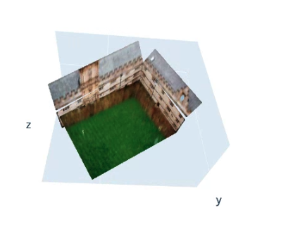

{:width="50"}

## Q1 Bunny


Camera matrix P

```
[[ 6.43e+03 -2.95e+03  1.15e+03  2.23e+03]
 [-9.35e+02 -6.75e+03  2.03e+03  1.82e+03]
 [ 5.79e-01 -1.42e+00 -7.35e-01  1.00e+00]]
```

## Q1 Cuboid


## Q2 Cathedral


Construct $x^\top \omega y = 0$ and solve for $\omega$ to retrieve $K$:

$$\begin{bmatrix}
x_1y_1 + x_2y_2 & x_1y_3 + x_3y_1 & x_2y_3 + x_3y_2 & x_3y_3 
\end{bmatrix}
\begin{bmatrix}
w_{11} & w_{13} & w_{23} & w_{33} 
\end{bmatrix}^\top = 0
$$

K matrix

```
[[1.15e+03, 0.00e+00, 5.75e+02],
[0.00e+00, 1.15e+03, 4.32e+02],
[0.00e+00, 0.00e+00, 1.00e+00]]
```

## Q2 Squares


The A matrix, resulting from conditions $ h_1^T w hh_2 = 0$ and $h_1^T w h_1 = h_2^T w h_2$
$$
\begin{bmatrix}
   x_1 y_1 & x_1 y_2 + x_2 y_1 & x_1 y_3 + x_3 y_1 & x_2 y_2 & x_2 y_3 + x_3 y_2 & x_3 y_3 \\
   x_1^2 - y_1^2 & 2 x_1 x_2 - 2 y_1 y_2 & 2 x_1 x_3 - 2 y_1 y_3 & x_2^2 - y_2^2 & 2 x_2 x_3 - 2 y_2 y_3 & x_3^2 - y_3^2
\end{bmatrix}
$$

K matrix
```
[[ 1.06e+03, -8.03e+00,  5.15e+02],
[ 0.00e+00,  1.08e+03,  3.76e+02],
[ 0.00e+00,  0.00e+00,  1.00e+00]]
```

angle 1:  66.03
angle 2:  92.50
angle 3:  94.97

## Q3 Walls


We use two reference points $p_i$: the yellow point is shared by four planes and the pink point is shared by three. These two points collectively represent all planes with normal $n_i$. 


K matrix
```
[[892.47,   0.  , 333.83],
[  0.  , 892.47, 361.11],
[  0.  ,   0.  ,   1.  ]]
```


For each ray $\vec{d}$ backprojected from each pixel, solve the equation $(t\vec{d} - p_i )^\top \vec{n_i} = 0$ for $t$. Thenm $t\vec{d}$ gives us the 3D point.



<!-- MathJax library for rendering LaTeX -->
<!-- example usage: $$\tilde{\theta}$$  -->
<script src="https://polyfill.io/v3/polyfill.min.js?features=es6"></script>
<script id="MathJax-script" async src="https://cdn.jsdelivr.net/npm/mathjax@3/es5/tex-mml-chtml.js"></script>
