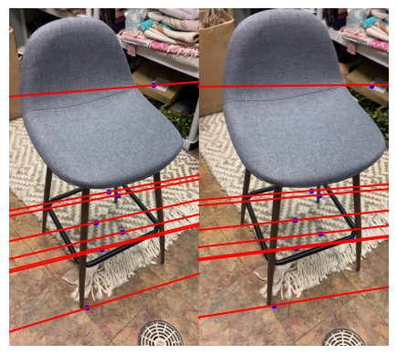
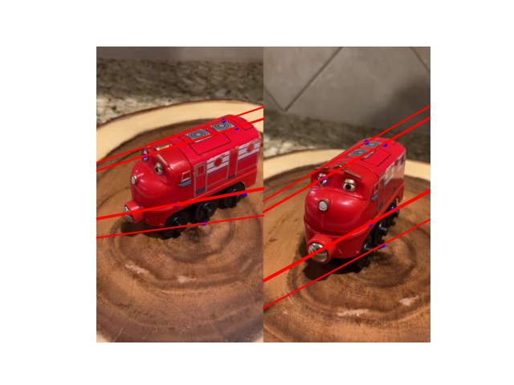

{:width="50"}

## Two view reconstruction pipeline


## (Step 2) 8 points algorithm for computing fundamental matrix F and essential matrix E

### 8 points Algorithm 
1. Normalize all points to be centered at zero and a fixed average distance. 
1. For each point correspondence $$x, y$$, set up linear equation $$y^{\top} F x = 0$$ where $$F = \begin{bmatrix} 
f_1 & f_2 & f_3 \\
f_4 & f_5 & f_6 \\
f_7 & f_8 & 1 \\
\end{bmatrix}$$
<!-- 1. rewrite the equation $$y_1(f_1x_1 + f_2x_2 + f_3x_3) + y_2(f_4x_1 + f_5x_2 + f_6x_3) +y_3(f_7x_1 + f_8x_2 + x_3) = 0$$ as  -->
1. rewrite the equation as $$\begin{bmatrix}y_1x_1 &  y_1x_2 &  y_1x_3  &  y_2x_1  &  y_2x_2  &  y_2x_3  & y_3x_1  &  y_3x_2  &  y_3x_3\end{bmatrix}\vec{f} = 0$$ 
1. Stack all equations into matrix $$A$$ of size $$N \times 9$$.
1. Solve $$Af = 0$$ for $$f$$ using SVD.
1. Enforce rank-2 condition on $$f$$ by taking only the first two singular values and then reshaping the last singular vector into $$3\times 3$$ matrix $$\tilde{F}$$.
1. Apply unnormalization by applying the transformation matrices to $$\tilde{F}$$: $$F = T_2^\top \tilde{F} T_1$$
1. Compute $$E = K_2^{\top} F K_2$$

### Results

|  Chair  | Teddy    | 
|--------------- | --------------- |
|    |    | 

- essential matrix E in chair scene
$$\begin{bmatrix}
  0.251 &   -6.068  &  -6.066 \\ 
 4.087 &   0.587   & -35.810 \\ 
 2.433 &   35.648  &   1.    \\ 
\end{bmatrix}$$

- essential matrix E in Teddy scene
$$\begin{bmatrix}
    -5.369 &  20.941 &   77.113 \\
  1.930 &  13.211 & -180.207 \\
-31.719 & 185.536 &    1.    \\
\end{bmatrix}$$


## (Step 2) 7 points algorithm for computing the fundamental matrix F


### 7 points Algorithm 
1. Normalize all points to be centered at zero and a fixed average distance. 
1. For each point correspondence $$x, y$$, set up linear equation $$y^{\top} F x = 0$$ where $$F = \begin{bmatrix} 
f_1 & f_2 & f_3 \\
f_4 & f_5 & f_6 \\
f_7 & f_8 & 1 \\
\end{bmatrix}$$
<!-- 1. rewrite the equation $$y_1(f_1x_1 + f_2x_2 + f_3x_3) + y_2(f_4x_1 + f_5x_2 + f_6x_3) +y_3(f_7x_1 + f_8x_2 + x_3) = 0$$ as  -->
1. rewrite the equation as $$\begin{bmatrix}y_1x_1 &  y_1x_2 &  y_1x_3  &  y_2x_1  &  y_2x_2  &  y_2x_3  & y_3x_1  &  y_3x_2  &  y_3x_3\end{bmatrix}\vec{f} = 0$$ 
1. Stack all equations into matrix $$A$$ of size $$7 \times 9$$.
1. Solve $$Af = 0$$ for $$f$$ using SVD.
1. Take the last two singular vectors as $$F_1$$ and $$F_2$$, with the general solution being $$F = \lambda F_1 + (1-\lambda) F_2$$.
1. Find $$\lambda$$ such that $$F$$ satisfies $$\text{det}(F) = 0$$:
   1. let $$f(\lambda) = \text{det}(\lambda F_1 + (1-\lambda) F_2)$$ and $$g(\lambda) = a_3 \lambda^3 + a_2 \lambda^2 + a_1 \lambda + a_0$$.
   1. Numerically calculate $$g$$ in order to set up a system of four equations $$f(\lambda) = g(\lambda)$$ and solve for $$(a_3, a_2, a_1, a_0)$$.
   1. Then solve $$(\lambda) = a_3 \lambda^3 + a_2 \lambda^2 + a_1 \lambda + a_0 = 0$$ for $$\lambda$$.
   1. Take the real root and form solution $$\tilde{F} = \lambda F_1 + (1-\lambda) F_2$$.
1. Apply unnormalization by applying the transformation matrices to $$\tilde{F}$$: $$F = T_2^\top \tilde{F} T_1$$
1. Compute $$E = K_2^{\top} F K_2$$

### Results

| Toybus   | Toytrain    | 
|--------------- | --------------- |
|    |    | 


<!-- ## (Step 2) Essential matrix E from fundamental matrix F and camera intrinsics K -->


## (Step 2) RANSAC for 7 points and 8 points algorithms

### RANSAC algorithm
1. sample minimum required number of point correspondences (either 7 or 8)
1. run the 7- or 8-points algorithm to find $$F$$
1. check if the epipolar line $$l^\prime = Fx$$ is close enough to the corresponding point $$x^\prime$$ for each correspondence
   - metric:
      ```py
      l1, l2 = get_epipolar_lines(F, x1, x2)
      d1 = np.abs(l1.T @ to_projective(x1)) / np.linalg.norm(l1[:2])
      d2 = np.abs(l2.T @ to_projective(x2)) / np.linalg.norm(l2[:2])
      metric = d1 + d2
      ```
1. count inliers: if epipolar line is close enough for more than 70% of the points, move to next step
1. repeat previous step of counting inliers for the entire set of correspondences and keep the $$F$$ if it fits more inliers than the previous best.

### Results

| Scene & algorithm    | Epipolar lines    | RANSAC progress (inlier count)    |
|---------------- | --------------- | --------------- |
| Teddy (7-points)    |  |  |
| Teddy (8-points)    |  |  |
| Chair (7-points)    |  |  |
| Chair (8-points)    |  |  |
| Toybus (7-points)   |  |  |
| Toybus (8-points)   |  |  |
| Toytrain (7-points) |  |  |
| Toytrain (8-points) |  |  |


## (Step 4) Triangulation

### Triangulation algorithm

1. Normalize all points to be centered at zero and a fixed average distance. 
1. For each point correspondence $$(x, y), (x^\prime, y^\prime)$$ with camera projection matrices $$P, P^\prime$$, 
1. write the equations as matrix $$A$$ of size $$4 \times 4$$.
$$
A = \begin{bmatrix}
x \vec{p}^{3\top} - \vec{p}^{1\top} \\
y \vec{p}^{3\top} - \vec{p}^{2\top} \\
x^\prime \vec{p}^{\prime3\top} - \vec{p}^{\prime1\top} \\
y^\prime \vec{p}^{\prime3\top} - \vec{p}^{\prime2\top} \\
\end{bmatrix}
$$
1. Solve $$AX = 0$$ for $$X$$ using SVD.
1. Take the last singular vector as $$X$$.


### Results

| Input 2D points   | <figure></figure>   |
| Reconstructed 3D points   |    |


## (Step 2 and 5) COLMAP for Bundle Adjustment
Red points mark the estimated camera location at each frame, and black points mark the sparse reconstructed 3D points.


|     | input    | output    |
|---------------- | --------------- | --------------- |
| Burj Al Arab <br> [video source](https://www.youtube.com/watch?v=5sThZ-ntTsM)    |     |      |
| Wat Muang Buddha <br> [video source](https://www.youtube.com/watch?v=VSxtJa_nQ8s)    |      |     |


<!-- MathJax library for rendering LaTeX -->
<!-- example usage: $$\tilde{\theta}$$  -->
<script src="https://polyfill.io/v3/polyfill.min.js?features=es6"></script>
<script id="MathJax-script" async src="https://cdn.jsdelivr.net/npm/mathjax@3/es5/tex-mml-chtml.js"></script>
