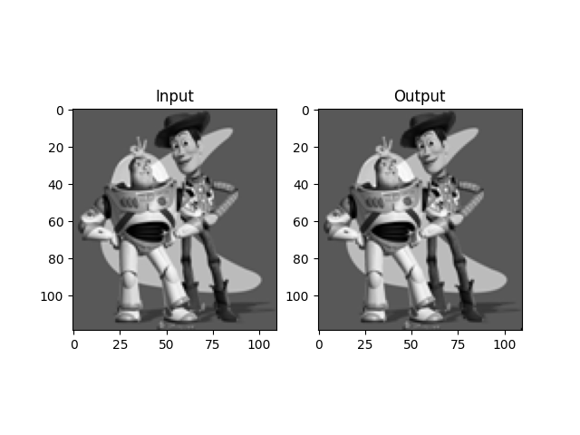
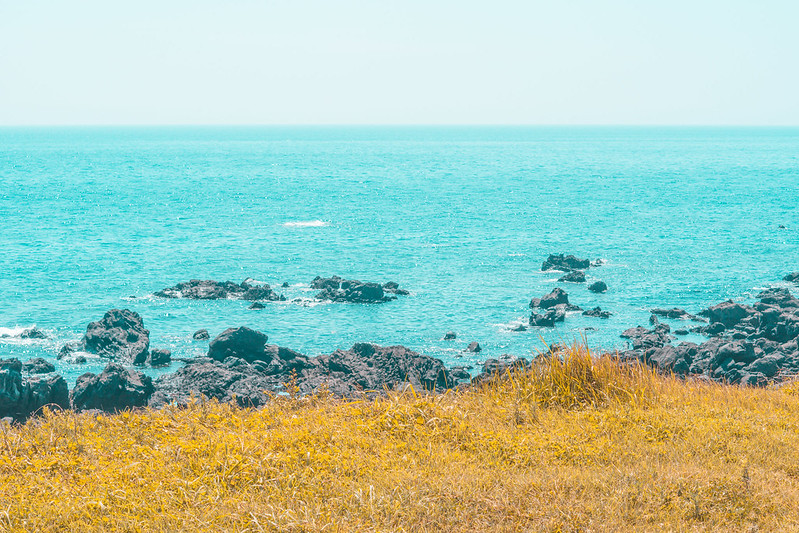
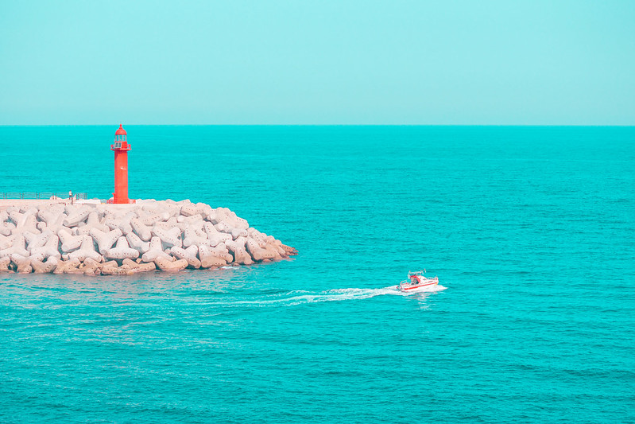
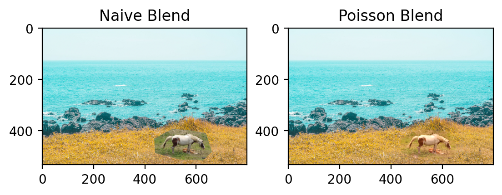
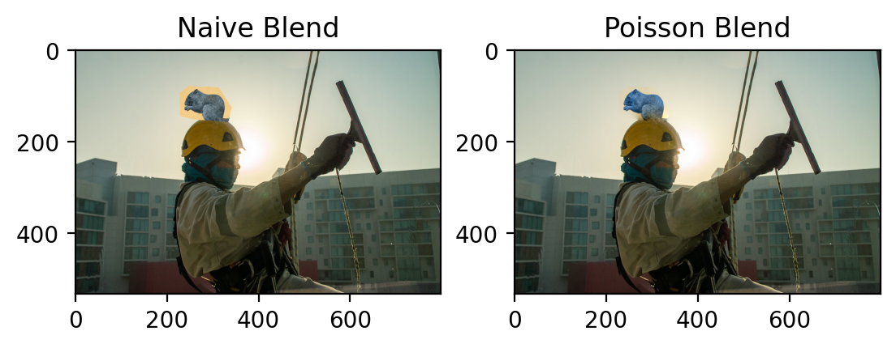

All images except for "Toy Example" section are mine.

When we make montage images, instead of simply copy-pasting an image cutout, it would be nice if the cutout can be edited to match the colour of the background. Poisson blending does this step for us.

## Poisson Blending
The following $$argmin$$ optimization is the essence of Poisson Blending.

$$\newcommand{\argmin}{arg min} \boldsymbol{v} = \argmin_{\boldsymbol{v}}\sum_{i \in S, j \in N_i \cap S}((v_i - v_j) - (s_i - s_j))^2 + \sum_{i\in S, j \in N_i \cap \neg S}((v_i - t_j) - (s_i - s_j))^2$$

where

- \\(s\text{: source image}\\)
- \\(t\text{: target image}\\)
- \\(v\text{: combined image, result of blending}\\)
- \\(S\text{: area where mask = True}\\)
- \\(S^c\text{: area where mask = False}\\)
- \\(N_i\text{: the neighbouring points of }i\\)

We start with a source image (usually an object in the foreground, smaller patch) and a target image (usually the background image, the entire scene will be used). We first draw a mask to decide which area of the source we want to paste into the target image. 

Next we look at the gradients of the three images: source, target, and combined. If we want the area inside the mask to be well blended, then we should try to match the gradient $$v'$$ of the new image to the gradient $$s'$$ of the source image, assuming we care more about the gradients than the actual pixel values. 

Near the border of the mask, however, we want the image to resemble both the source and the target image. Specifically, we want to have the same **shape** as the source image but have the same **colour** as the target image. So we try to match the pixel value $$s$$ of the source image to $$t + s'$$ which is the pixel value of target image $$t$$ but changed by the gradient of source image $$s$$.

## Toy example
In this example, we try to reconstruct an image by looking at the gradients of an image and a single pixel. If we can maintain the gradients as well as that single pixel, we should be able to recover the original image.

## Blending Result
{:width="384"}
{:width="384"}
At first, I combined the above two images to get the blended result below.

But there were two problems here. The first is that the scale of detail in the waves is off. The second is that although I tried to align the horizon in the two images exactly, due to weather conditions the contrast between the sky and sea are different and so the colour of the sky has not blended in very well. 

After changin the magnification and cropping out the sky, I got the image above. It is not perfect either -- the colour of the rocks blended into the patch. This could have been prevented with a more content-aware crop. 

## Discussion
1. Horse blended into cliff:

1. Fireworks blended into skyline:

The first two blended images here point to the fact that blending works well if the surrounding texture in both the source and target images have similar roughness in texture and a similar colour. If I were to position the patches differently, it would not have worked so seamlessly.
 
 

1. Person blended into waterfall:

While this image above involving my father is my favourite, it is not the most seamless. That is because the level of focus blur is different for the target and source images. However, making the patch very small helps it to go unnoticed for unassuming eyes. 
 
 
1. Squirrel blended onto helmet:

I thought this image of a squirrel would have worked very well -- and although the blend itself is quite seamless, the colour of the squirrel is very off. I guess what I thought were two similar colours in the sky and in the background of the squirrel were actually quite different. It seems that to match the two colours, the colour of the squirrel was sacrificed.

<!--  -->
<!--  -->