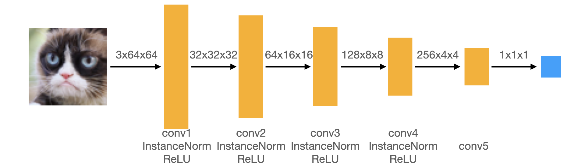
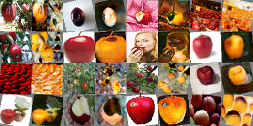
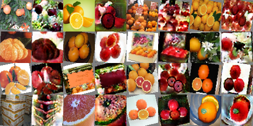

We will talk about Deep Convolutional GANs (DCGAN) and CycleGANs. 

## Goal

1. Generate cat pictures from a randomly sampled noise vector in the latent/feature space.
1. Translate between images of two different types of cats (grumpy and Russian Blue)
1. Translate between images of apples and images of oranges

##1. Deep Convolutional GAN

DCGAN is just GAN but with convolutional layers. 

### Deep Convolutional Discriminator

The above image (taken from course website) describes the layers in the discriminator but we need to determine the sizes of the kernel, stride, and padding. We downsample the image by a factor of two using the following formula.

$$
(O \times S)+(K-S) = (I+2P) \\ 
O = I /2 
$$

Where O is output size, I is input size, K is kernel size, S is stride, and P is padding. 

##### Padding
We are given kernel size K=4, stride S=2. When S is equal to the downsampling factor, the actual values of O and I become irrelevant and we get P=1 for all layers except `conv5`, where we don't need padding nor a stride if we use a kernel size K=4.

### Deep Convolutional Generator Up-convolution

The first layer of the generator is given input of size 1x1 which needs to be quadrupled to 4x4. Through multiple experiments, I found that using a kernel size K=5, stride S=1, padding P=2 after scaling the image to the desired size made the training more stable.

### Preprocess Augmentation and Differentiable Augmentation

I used all three DiffAug policies `color,translation,cutout` and in deluxe data augmentation, I used `RandomCrop`, `RandomHorizontalFlip`, `RandomRotation` transforms on top of the basic data augmentation transforms. 

I applied DiffAug to both fake and real images any time the images needed to go through the discriminator. I also called `.detach()` method on fake images only when training the discriminator to fix the generator.

##### Visual Comparison
vanilla gan grumpy cat basic: 
 
**vanilla gan grumpy cat basic diffaug:**
 
vanilla gan grumpy cat deluxe: 
 
**vanilla gan grumpy cat deluxe diffaug:**

The effects that I can observe from running 6400 iterations with these different settings are:
- Data augmentation helps. Applying either `deluxe` or `diffaug` significantly enhances the image quality.
- `diffaug` seems to work better than plain `deluxe`. Perhaps because the effect of `diffaug` is only applied to the discriminator. With the `deluxe` option, the generator must learn to generalize a broader range of data, which may have been difficult with just 6400 iterations.
- In the case that `diffaug` was applied, the deluxe augmentations allow more variance in the output images but the results are not as clean as the basic augmented output. Running for longer may have produced a different outcome. 

### Loss graph comparison
The generator's loss for cases where DiffAug is applied is consistently lower than when it is not.
The loss when using deluxe augmentation is slightly lower but not significantly.
This trend is exactly the mirror opposite for discriminator losses. 
This demonstrates that augmentation helps the network learn better. 

##### Generator Loss

##### Discriminator Loss

### Improvement over time
In the beginning, the generated images have "aliasing" effects. Therea are horizontal and vertical lines that are often noticeable in low quality JPEG- or PCA- compressed images. However, the overall structure already exists and is quite discernible. As we iterate more, the aliasing effect goes away and higher frequency detail is improved.

**iteration 200:**

**iteration 3200:**

**iteration 6400:**

##1. CycleGAN
The domain of the CycleGAN Generator is different from that of vanilla GAN. Vanilla GAN samples from noise but CycleGAN translates an image to an image. 

Again, the above image is taken from course website. The discriminator of CycleGAN is expands on that of vanilla GAN by using Patch Discriminator. This discriminator divides the output image into four patches and decides how realistic each patch is. This method forces detail to be consistent across different areas of the image, instead of, for example, having very realistic features in just one area.

### Results: Grumpy ⇄ Russian Blue
##### Effect of cycle consistency loss
The effect of cycle consistency loss is not very pronounced for `grumpy to russian blue`, but the results of `russian blue to grumpy` show the effect a little bit. In the images generated without using cycle consistency loss, the russian blue cats are definitely *unlike* grumpy cats, but not necessarily the best representation of russian blue cats. In the images generated using cycle consistency loss, the russian blue cats are more *like* russian blue cats. 

**At iteration 1000 *without* cycle consistency loss:**

**At iteration 1000 *with* cycle consistency loss:**

##### Effect of DC vs Patch discriminator 
The most notable difference in the effect of the two discriminators can be seen in the cats' eyes. In the images generated with a DC discriminator, the overall structure matches the target cat, but detail in the eyes are not very expressive. On the other hand, using patch discriminator enhances local detail like the eyes.

**With DC Discriminator:**

**With Patch Discriminator:**

### Results: Apple ⇄ Orange
##### Effect of cycle consistency loss
This one is funny. Without cycle consistency loss, generated oranges are *ooooooranggggeeeee* but not orange. The generated apples scream *apppppllplplllleeee* but are not apples. With cycle consistency loss, oranges are more like oranges and apples are more like apples. The reason could be attributed to the fact that it's hard to generate an apple from an *ooooooranggggeeeee*, so the network is regularized to not overshoot the optimization and instead just produce an *orange*.

**At iteration 1000 *without* cycle consistency loss:**

**At iteration 1000 *with* cycle consistency loss:**

##### Effect of DC vs Patch discriminator 
The difference here is hard to tell. The original images are not preprocessed enough (though the cat images were) for there to be meaningful difference in the local texture. 

**With DC Discriminator:**

**With Patch Discriminator:**

### Final results
Using cycle consistency loss, patch discriminator, 10,000 iterations

<!--  -->
<!--  -->