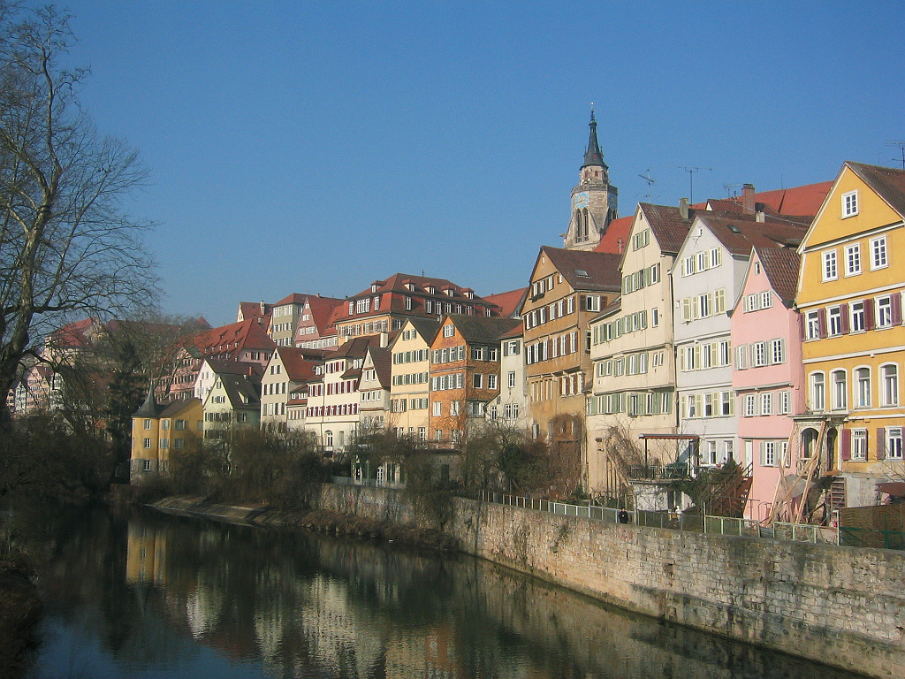

## Goal

1. Explore difference between content loss vs style loss
<!-- 1. Explore L-BFGS optimizer -->
1. Perform content reconstruction
1. Perform texture synthesis
1. Perform style transfer
<!-- 1. Film Style transfer -->

## Reference Papers
- [Texture Synthesis Using Convolutional Neural Networks, Gatys et al., 2015](https://arxiv.org/pdf/1505.07376.pdf)
- [A Neural Algorithm of Artistic Style, Gatys et al., 2015](https://arxiv.org/pdf/1508.06576.pdf)


## Content Loss

Content loss is the squared difference between the feature maps of two images, which can be optionally normalized or averaged. We use a pretrained VGG-19 model to get the feature maps. We have a choice of which layer $$L_i$$ to use as a basis for calculating content loss. 

## Content Reconstruction


|  |  |
|:-:|:-:|
| ![Alt text][conv1]{:width="384"} ☝ content loss layer after `conv_1` | ![Alt text][conv2]{:width="384"} ☝ content loss layer after `conv_2` | 
| ![Alt text][conv4]{:width="384"} ☝ content loss layer after `conv_4` | ![Alt text][conv8]{:width="384"} ☝ content loss layer after `conv_8` | 

<br>

We test the effect of placing the content loss at different locations inside VGG-19 on reconstruction quality. Each convolution layer captures different levels of detail and thus the distance in each feature map space represent different things. For reconstruction purposes, obviously it's best to use the original input layer ($$i=0$$) but we may want to base the content loss on a different layer to achieve different styles. I personally like the reconstruction result using a loss layer after `conv_4` because it is reminiscent of an HDR image. 


|  |  |
|:-:|:-:|
| ![Alt text][conv4]{:width="384"} | {:width="384"} | 

☝ Content loss layer based on output from `conv_4` but the two images were initialized with two different noises. The difference is indiscernible to the human eye at a distance.


|  |  |
|:-:|:-:|
| {:width="384"} ☝ difference between the two images instantiated as different noise samples | {:width="384"} ☝ difference between one of reconstructed images and the original image |

<br>
We can see that the difference between the two images is just noise. We can also see that the reconstruction results using content loss based on later convolutional layers still manage to retain edges. 

## Texture Loss

Texture loss is similar to content loss - we compare the values of features of two images. However, whereas content loss is calculated by comparing the values of the same feature channel of the same layer, texture loss is perhaps 'less forgiving' because we want the texture loss to be optimized across the entire channel. So we compute the Gram matrix:

<div>$$ G = X^TX = \left(\begin{array}{c} x_1^T \\ \vdots \\ x_m^T \end{array}\right) \left(\begin{array}{ccc} x_1 & \ldots  & x_m \end{array}\right)$$</div>

Where each vector $$x_i$$ is a vectorized feature map in a layer, and $$X$$ represents all the feature maps in a layer.

## Texture Synthesis


Below are textures syntehsized from Frida Kahlo's *Self-portrait with Thorn Necklace and Hummingbird* (1940).

|  |  |
|:-:|:-:|
| {:width="384"} | {:width="384"} |
|☝ texture synthesized by placing texture loss layers after each layers: `conv_1` and `conv_2` |☝ texture synthesized by placing texture loss layers after each layers: `conv_3` and `conv_4`|
| {:width="384"} | {:width="384"} |
|☝ texture synthesized by placing texture loss layers after each layers: `conv_5` through `conv_8` |☝ texture synthesized by placing texture loss layers after each layers: `conv_9` through `conv_12`|

<br>
We can see that the earlier we place the texture loss layers, the larger the detail is. For instance, the top row depicts blobs of colour that represent the image while the bottom row depicts more of the characteristic thorny and pointy texture of the thorns and leaves. Texture synthesized with texture loss layers placed after `conv_9` through `conv_12` was closer to noise than texture, so it was ommitted. 

|  |  |
|:-:|:-:|
|  {:width="384"} |   {:width="384"} |

☝ Texture loss layer based on output from all conv layers but the two images were initialized with two different noises. We can clearly see that these two images are different. 

The above result may come as a surprise because I had mentioned that the texture loss is 'less forgiving' but the two images turned out quite different. Unlike the results of image reconstruction from content loss, it is impossible to force all features of the texture loss layer to be the same with each other due to its construction using Gram matrix.


## Style Transfer

Now we put both content loss and texture loss into the equation. 

The hyperparameters I often had good results were:
```python
content_layers="conv_9" 
style_layers="conv_2,conv_4,conv_8,conv_16" 
content_weight=1
style_weight=0.5 
```

My workflow for finding the best output is as follows:

1. Choose two images that have similar themes. eg\) buildings, portrait, grungy, dark background & light foreground, etc.
1. tune texture loss layer location by synthesizing texture
1. tune style weight and steps (I found these to have less impact on overall image quality)


## Results

On my GPU, there is not much of a difference whether we run the algorithm with an image prior or with a randomly sampled noise.

|  |  |
|:-:|:-:|
|  {:width="384"} | {:width="384"} |
|  ☝ about 100 seconds   | ☝ about 100 seconds  |

<br>
Results using dataset:


|            |  {:width="192"}  |  {:width="192"}  |
|       :-:       |           :-:    |         :-:      |
| {:width="384"}  |   {:width="384"} |  {:width="384"} |
| {:width="384"}  |   {:width="384"}   |   {:width="384"} |


<br>
Results using some of my own photos:

|            |  {:width="192"}  |  {:width="192"}  |
|       :-:       |           :-:    |         :-:      |
| {:width="384"}  |   {:width="384"} |  {:width="384"} |
| {:width="384"}  |   {:width="384"}   |   {:width="384"} |


<script src="https://polyfill.io/v3/polyfill.min.js?features=es6"></script>
<script id="MathJax-script" async src="https://cdn.jsdelivr.net/npm/mathjax@3/es5/tex-mml-chtml.js"></script>
<!-- <script type="text/javascript" src="{{ site.baseurl }}/assets/js/MathJax/MathJax.js"></script> -->
<!-- <script type="text/javascript" src="https://cdnjs.cloudflare.com/ajax/libs/mathjax/2.7.1/MathJax.js"></script> -->


[conv1]: data/Reconstructed%20Image-conv01.png
[conv2]: data/Reconstructed%20Image-conv02.png
[conv4]: data/Reconstructed%20Image-conv04.png
[conv8]: data/Reconstructed%20Image-conv08.png