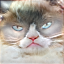

## Reference Papers
- [GAN Inversion: A Survey, `Xia` et al. (2021)](https://arxiv.org/abs/2101.05278)
- [Image2StyleGAN: How to Embed Images Into the StyleGAN Latent Space?, `Abdal` et al. (2019)](https://arxiv.org/abs/1904.03189)

##1. Inverting the Generator

The original image that we will try to reconstruct by inverting a GAN generator:

{:width="384"}

 

Below we show some example outputs of image reconstruction using different loss functions, different types of generative models, and different types of latents space vectors.

 

|  | *perceptual loss only*  | *perceptual loss, $$l_1$$, $$l_2$$ loss* |
|:-:|:-:|:-:|
| *vanilla GAN + z* | {:width="300"} | {:width="300"} |
| *StyleGAN + z* | {:width="300"}      | {:width="300"} |
| *StyleGAN + w* | {:width="300"}      | {:width="300"} |
| *StyleGAN + w+* | {:width="300"}     | {:width="300"} |

##1. Interpolate your Cats

Now that we found a way to reconstruct the cat images from latent vectors, we can interpolate between the cat representations in the latent space and then map those interpolated latent vectors to the cat images using the same reconstruction method above.

 

|  | $$\text{cat}=A$$ | $$\text{cat}=A+t(B-A)$$ | $$\text{cat}=B$$ |
|:-:|:-:|:-:|:-:|
| Original | {:width="180"} |  | {:width="180"} |
| reconstruction   using $$w+$$ vector | {:width="180"} | {:width="180"} | {:width="180"} |
| Original | {:width="180"} |  | {:width="180"} |
| reconstruction using   $$w+$$ vector | {:width="180"} | {:width="180"} | {:width="180"} |

While in the latent space the vectors progress smoothly, the cat images do not. There are big jumps between each frame of interpolation. On the other hand, the quality of each frame is almost as good as any reconstruction of real cats. One thing to note is that there are some frames, like frame #9 in the top GIF, where some facial features are not pronounced enough: 

{:width="300"}

This phenomenon is interesting because when we train the generator model, we sample Gaussian noise from the latent space, where assumably most training data lies in. This may signify that some cat images lie slightly outside the distribution of cat images in the latent space.

##1. Scribble to Image

Now let's draw cats, and get an approximation of the drawings as cat images.

{:width="300"}

☝ This scribble image is approximated as cat images below. The weight of the regularization term has a big effect in this case, because the scribble image lies completely outside the distribution of our usual cat images.

 

|  | iteration=500 | iteration=1000 |
|:-:|:-:|:-:|
|regularization   weight = 0  | {:width="300"} | {:width="300"} |
|regularization   weight = 1  | {:width="300"} | {:width="300"} |
|regularization   weight = 3  | {:width="300"} | {:width="300"} |

With little regularization, our reconstruction optimization will try to find the latent vector that will map to an image closest to the scribble, period. However, we may not want that. We want the final image to still look like a cat. So where do we draw the line? Experimentally (visually), the weight of regularization term that works best with perceptual loss should maintain the colours and structure of the scribble while also still looking like a cat.

Here are some good cases where the results turned out quite nicely. 

|  |  |
|:-:|:-:|
| {:width="200"}  |  {:width="200"} |
| {:width="200"}  |  {:width="200"} |
| {:width="200"}  |  {:width="200"} |
| {:width="200"}  |  {:width="200"} |
| {:width="200"}  |  {:width="200"} |
| {:width="200"}  |  {:width="200"} |
| {:width="200"}  |  {:width="200"}|

And just for fun, I also tried the same thing but instead of a scribble, I used an (AI generated) image of a person just to see how they would look like as a cat. Okay, the generator forced something out, but let's not.

<!--  -->
<!--  -->
