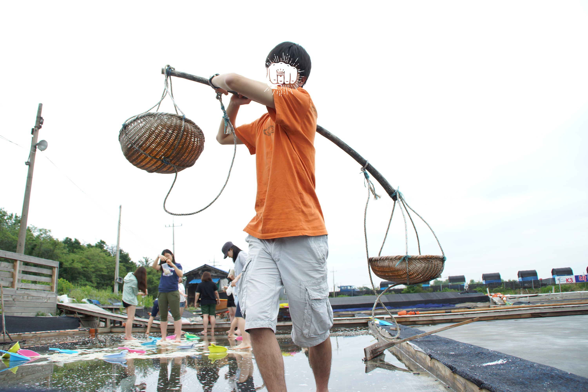
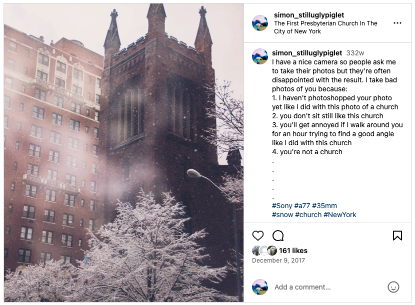
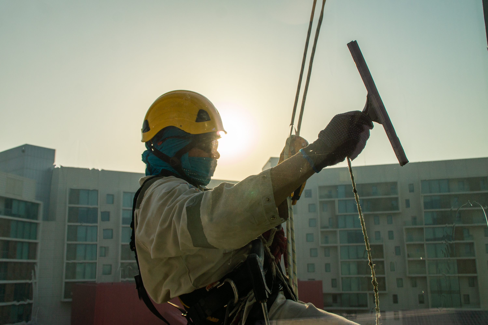
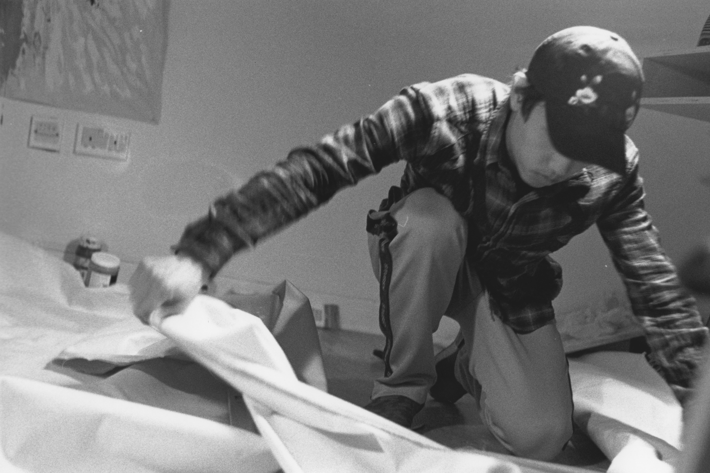

최근에 스냅챗에서 일하기 시작하면서 사진에 대한 생각을 다시 하게 된다. 다음 주면 DSLR을 든지 12년이 되지만 초상사진은 아직도 어렵다. 그래서 초상사진에 대한 내 생각이 어떻게 변했나 정리해봄.

### 2012-2014

- 어렵다는 생각조차 아직 못했다. 틀리는 것에 대한 겁이 없었기 때문에 막 찍었고 많이 찍었다. 그러다보니 재밌는 사진도 많이 찍혔다.
- 초상사진에 녹색을 많이 넣었는데 색약인 나는 그런 줄도 모르다가 친구가 지적해줘서 깨달았음. 사람은 사람 피부색이 조금만 색이 바뀌어도 금방 눈치챈다는걸 깨달음.
- 학교 교내 학생 잡지 Quill을 위해 사진을 찍는데 드라마틱한 사진을 찍고 싶어 컬러스플래시, 합성, 믹스미디어 등을 시도해봤지만 다 짜쳤다.

### 2015-2016
- 친구들 비자/여권/링크드인 사진을 많이 찍어줬다. 화면과 인쇄물의 색 차이에서 충격받음. 입술이 보라색으로 나왔더라.
- 틀이 있는 작업이다보니 내 사진을 다른 사진들과 비교하기 쉬워졌고 조명에 대한 이해가 낮다는 걸 깨달았음.
- 인종에 따라 피부톤이 굉장히 달라서 보정과 조명에 어려움을 겪음.
- 전세계적으로 봤을 땐 생김새와 그 사람의 배경이 상관 없는 경우가 많단걸 깨달음. 예로 남미 사람들은 필리핀, 유럽, 아프리카 사람들과 비슷하게 생긴 경우가 많음

### 2017

- 이 때 쯤부터 초상사진이 어렵다는 걸 느끼고 두려워했음.
- 사물은 정적이라 잘 안 나왔으면 다시 찍어도 되지만 사람은 자의로 움직이기 때문에 타이밍과 카메라 컨트롤이 중요하고 내 뜻대로 안 나왔다 하더라도 다시 찍을 수 없음.
- 사진가와 피사인의 인터렉션이 사진에 영향을 많이 끼친다는 걸 깨달음. 사물처럼 대하지 않으면서 단시간 안에 친밀해질 수 있는 방법이 뭘까 고민했음. Humans of New York의 인터뷰 기법이 궁금했다.
- 문화마다 "예쁜" 초상사진에 대한 기준이 다르다는 걸 깨달았다. 예로 미국 사람들은 다리가 길게 나오는 걸 별로 중요하게 생각하지 않음.
- 길거리 사진 등에서 허락에 대한 고민을 했다. 모르는 사람에게 말 거는 건 무섭고, 양자역학적으로(?) 허락을 받으면 사진에 영향을 주게 되고, 언어가 안 통하면 어떻게 해야 하나 고민했다.
- 인스타그램에서 좋아요를 많이 받는 사진이 무엇인가 분석을 했다. 내 생각에는 색과 구도 등 사진의 질적 특성이 중요하다고 생각했는데 여러 AI 모델을 적용해보니 인물의 존재여부와 업로드한 사람의 인기도 등 '사람'에 대한게 훨씬 더 중요하다는 결과에 이름.

### 2018

- 노동자나 소외계층 등 나와 다른 삶을 촬영하는 것에 대해 생각해보았다.
- 사진가가 피사체의 representation에 대한 무한한 힘을 가지고 있다는 생각이 들어 인물 사진은 폭력적이라는 생각을 갖게 되었다.
- 인물 사진을 통해 인물에 대한 내 편견을 표현하는게 무서웠다.
- 이 쯤부터 내 프로필 사진을 바꾸는 것에 대해서 조심스러워졌다.
- 보편적인 아름다움이 뭔지 자주 생각했고
- (대자연과 더불어) 인체가 가장 근본적이고 모든 사람이 공감할 수 있는 아름다움이라고 생각하기 시작했다.
- 나체 페인팅을 많이 찾아봤고 특히 여성이 여성을 어떻게 표현하고 싶어하는지에 관심이 생겨서 인스타에서 여성 작가들을 팔로우함.

### 2019-2020

- 한학기짜리 사진 수업을 처음 수강했다. 후반은 인물사진이 주제여서 사람을 사진으로 표현하는 방식이 다양할 수 있다는 걸 깨달은 동시에 어떤게 좋은 인물사진인지 헷갈렸다.
- 인물 사진에서는 보통 얼굴이 제일 중요하지만, 케첩이 들어간 음식에서는 케첩맛만 나는 것처럼 얼굴이 들어간 사진은 다 재미없어졌다.
- 사람의 뒷모습이나 그 사람이 있는 배경이나 그 사람의 소유물로 표현하는 방법에 관심이 생겼다.
- 촬영을 허락해준 대가로 피사인에게 즉석에서 사진을 인화해서 나눠줘봤다. 디지털 촬영 후 인화는 너무 느려서 인스탁스를 사거나 영수증 프린터 사진기를 만들어야겠다고 생각했다.
- 이 때는 필름을 많이 썼음

### 2021-2022
- 이때는 코로나랑 군대 때문에 카메라를 쓸 일이 많이 없어서인지 사진에 대한 관심이 많이 줄었음
- 그래도 군교회 방송실과 UCC 제작 목적으로 가끔씩 카메라를 만지긴 했다.

### 2023-2024

- 좋은 인물 사진의 기준을 완전히 잃어버렸다...기 보단 피사인의 판단에 모두 맡기는 중이다.
- 웨딩 사진 - 받는 사람이 기분 좋으면 좋은거지
- 스냅챗 - 셀카 찍은 사람이 기분 좋으면 좋은거지
- 스냅챗에서 일하면서 다시 한 번 보편적인 아름다움에 대해 자주 생각한다. 조명, 피부 질감, 표정 등 기본적인 요소들을 다시 생각하고 있다.
