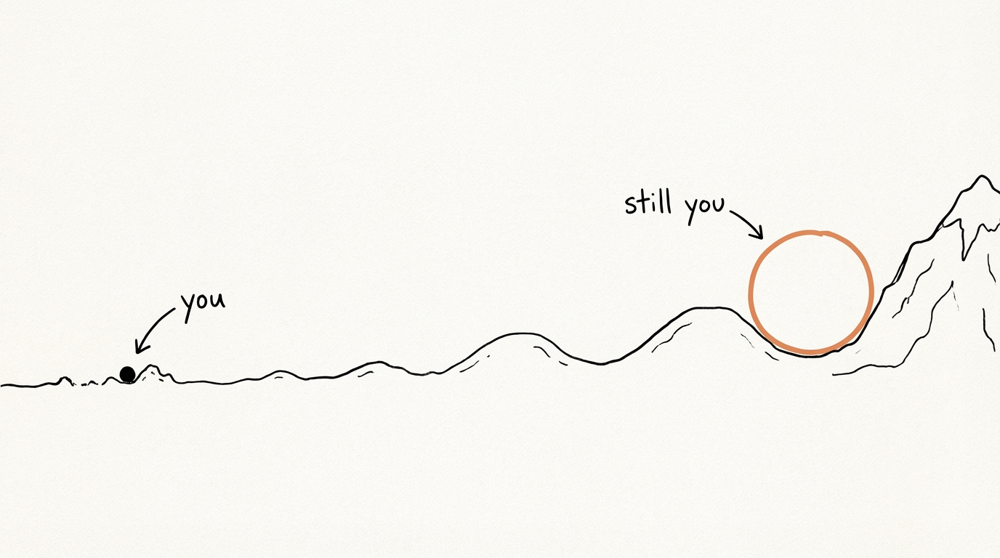
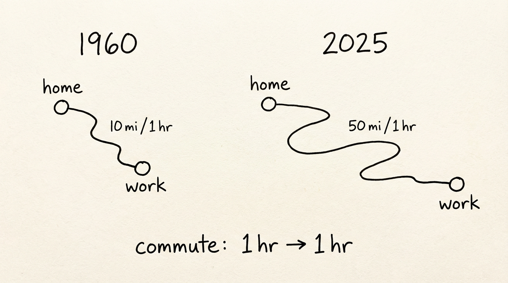
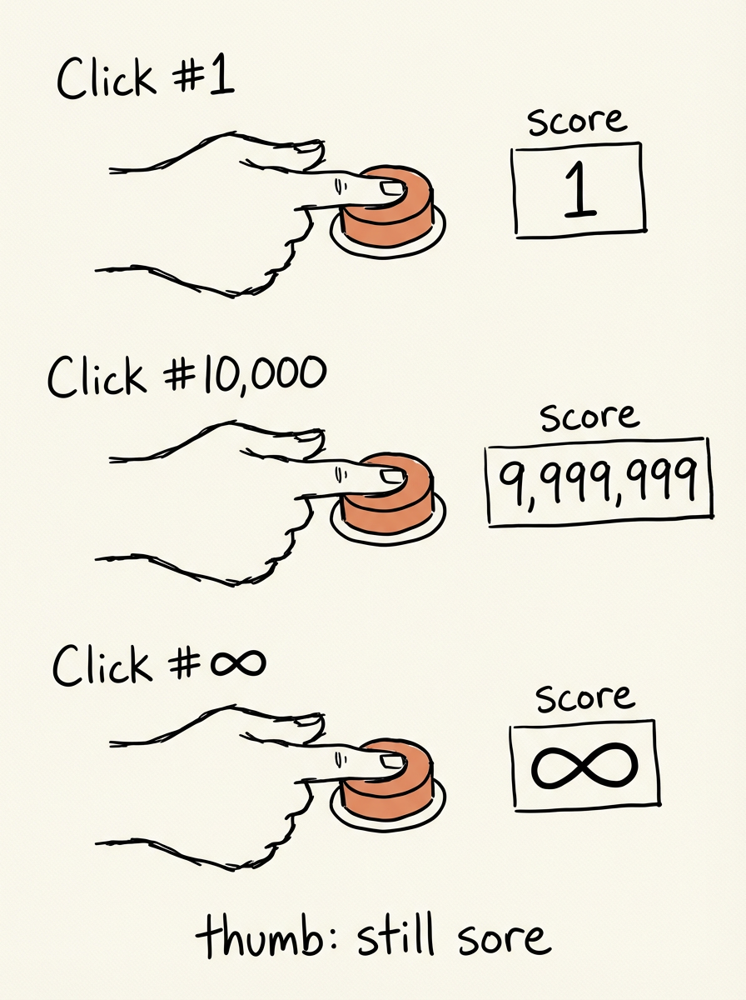
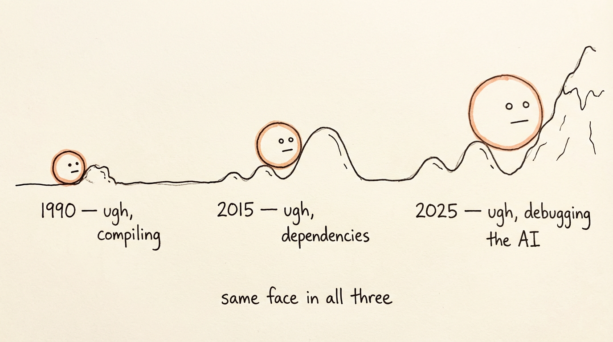
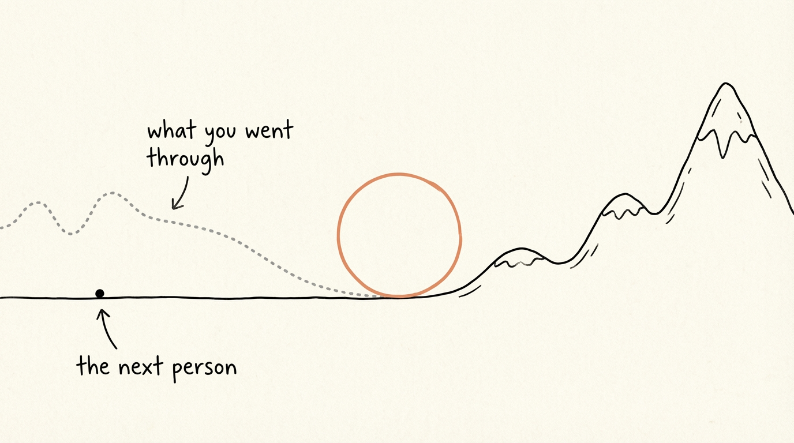

맨 끝에 세줄 요약 있음

Sisyphus sits in a cafe past midnight, debugging something that an AI tool was supposed to make trivial. A stranger offers him a drink and asks "why do you seem frustrated?"

Sisyphus: AI has made our lives easier for one quick second. But we've seen this pattern repeat throughout history. Technology does not free us. I say this as someone who still wakes to the same hill.

Think of it this way: imagine us as a stone moving through time. The road is full of bumps, and technology is a boulder with an ever-growing radius. Without it, we trip on small obstacles. With it, we roll over them.

The boulder gets bigger, and we go farther and faster, straight into mountains we couldn't even reach before. But then in front of mountains we get stuck again. From the perspective of labor, nothing changes.

The Poet: You speak of boulder and mountains; I hear the shape of your daily commute.

Sisyphus: Let me make that shape concrete: think about the 405. Without freeways, maybe you go 10 miles in an hour. With the development of freeways and fast cars, maybe you go 50. So people spread farther out, and we still commute for an hour. Same burden, bigger map.

The Poet: "Induced Demand" -- build more lanes, and you invite more cars. Remove one limit, and life fills the new space.

Sisyphus: That's exactly why I've been frustrated. The recent AI boom made work easier for a moment, then I was back to debugging. Different problems, same pain.

I keep waiting for the boulder to get lighter; it just gets better polished.

<!-- <iframe data-testid="embed-iframe" style="border-radius:12px" src="https://open.spotify.com/embed/track/5imShWWzwqfAJ9gXFpGAQh?utm_source=generator" width="100%" height="152" frameBorder="0" allowfullscreen="" allow="autoplay; clipboard-write; encrypted-media; fullscreen; picture-in-picture" loading="lazy"></iframe> -->

I've felt this most clearly with clicker games. You start by clicking for one point, then ten, then a thousand, then a million. The numbers explode, but your thumb is still sore.

The Poet: That might be your better analogy. The points-per-click rise, but the clicking remains.

Sisyphus: So will technology ever free us?

The Poet: Not in the total sense you're hoping for.

Technology frees us from specific constraints. It does not eliminate constraint itself.

Keynes predicted in 1930 that by 2030 we'd work 15-hour weeks. He was right about productivity growth, wrong about what we'd do with it.
Every generation repeats this arc: productivity rises, expectations rise with it.

Sisyphus: That's bleak.

The Poet: It can be, unless we name the real choice.

Hannah Arendt distinguished labor from action. Labor keeps us alive; action is how we make meaning together. Technology can reduce labor, but we often spend that gain on more work instead of more action.

The question is not whether tools remove effort forever. The question is what we choose to do with the effort they save.

Sisyphus: Then what does technology actually change?

The Poet: The floor rises. Hardship does not vanish. But much of what was once inevitable is now avoidable, and we forget because we adapt.

But the person born tomorrow inherits a flatter road. That might be meaning enough.

Sisyphus: And my debugging?

The Poet: Close the laptop tonight. The bug will still be there in the morning.

In the morning, you'll still push the boulder for the person behind you. Let me answer in words I once wrote about stones:
"And when one of you falls down he falls for those behind him, a caution against the stumbling stone.
Ay, and he falls for those ahead of him, who though faster and surer of foot, yet removed not the stumbling stone."

Sisyphus: You wrote that? Who are you?

The calm stranger smiles.
The Poet: I am Khalil Gibran.

---

**세줄 요약**

1. 시지프스가 불평함: “AI 생기면 편해질 줄 알았는데 디버깅만 더 늘었네?”
2. 시인 아저씨가 뼈 때림: “도로 넓히면 차 늘듯, 생산성 늘면 일도 늘지”
3. 사실은 칼릴 지브란이었던 아저씨가 격려해줌: "너무 일만 하지는 말아라, 그리고 결국 쓸모있는 일이니까 힘내라"