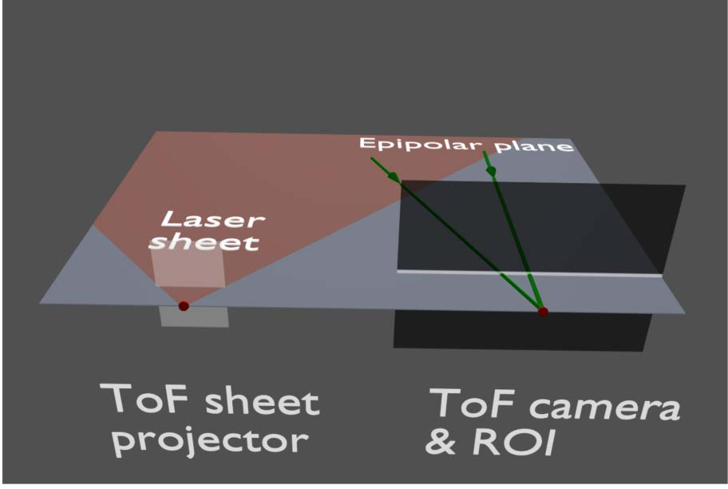
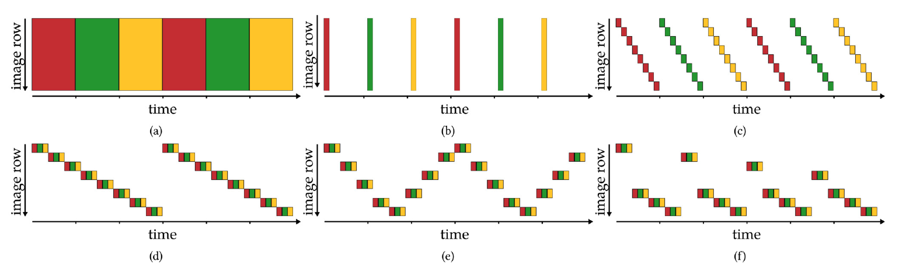
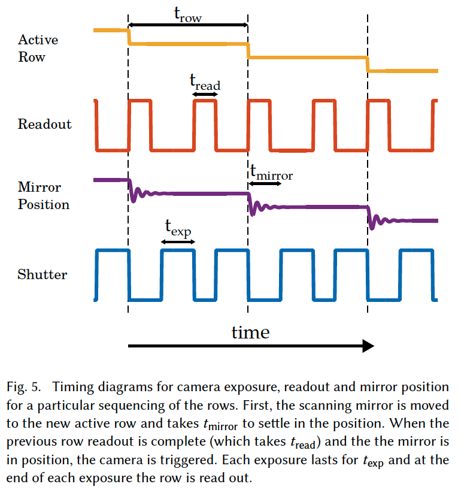

Let's talk about Achar et al.'s paper "Epipolar Time-of-Flight Imaging". This relates to my MSCV capstone project "Neural Synthetic Wavelength Interferometry" in that this method and our method both use continuous-wave Time-of-Flight (CW-ToF) sensors. This paper notes CW-ToF sensor's shortcomings and tries to improve it. In my capstone project, we improve on it by applying neural networks to some parts of the pipeline. 

### What this paper does well

The strength of this paper is not only its wide applicability, but a thorough consideration for the applications, including eye safety, power consumption, interference & interreflections, and different use cases.
The author provide a well explained and useful comparison between epipolar planes' sampling orders for each scenario. For example, figure 3(e) depicts a scheme that is robust against camera shake (and thus reducing blur in depth map) and samples at twice the speed to fix rolling shutter effect (but sacrificing vertical resolution). Figure 3(f) depicts a scheme assumes a scenario where the sensor is mounted to a car and allows sampling less from the horizon where objects move slowly on the sensor as opposed to near the ground (near the sensor) where things move faster in the projected image.

### Questions and Exploration
- Can we use a compliant mechanism to move the scanning mirror, to achieve better longevity?
- Where is the remaining noise coming from?
- Why are LIDAR sensors expensive, and does this prototype mitigate the high cost?
- Can we say that epipolar ToF imaging is a generalized version of the usual CW-ToF that uses a *0D* laser light source, whereas the epipolar ToF sensor uses *1D* lasers? Or is it just LIDAR that uses 0D light sources
- Is a horizontally sweeping snesor (that uses a vertical epipolar plane) better at mitigating rolling shutter effect on a moving vehicle?
- Why do the authors use two exposures/readouts per row in figure 5?
