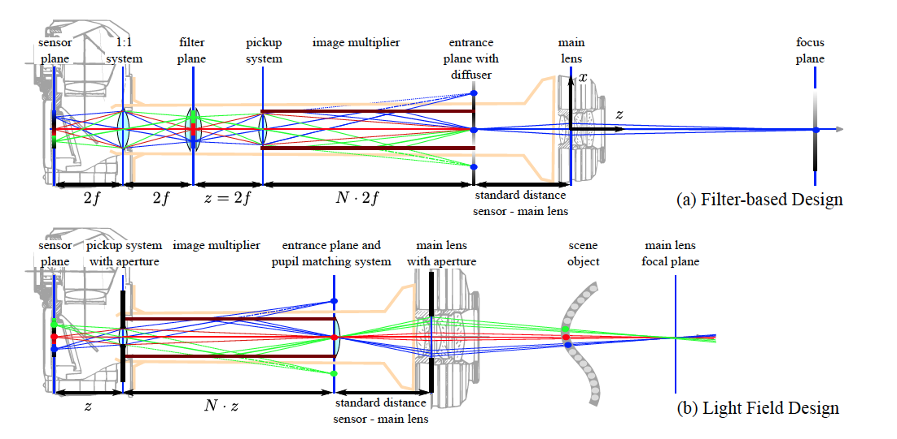

Let's take a look at this paper: *A Reconfigurable Camera Add-On for High Dynamic Range, Multispectral, Polarization, and Light-Field Imaging*. This paper describes a new configuration of lenses and mirrors that can be useful for HDR images and light field images. 

The authors first list three usual approaches to achieving these effects. Direct quote:

> 1. temporal multiplexing where an image stack is recorded and different filters are placed in the light path of different exposures. 
> 1. hardware parallel acquisition, where the optical image is multiplied by means of a beam-splitter arrangement and projected onto dif ferent sensor units that are spatially de-localized. 
> 1. spatial multiplexing. Here, a single sensor unit is being employed where every pixel is associated with a different optical pre-filter.

Their hardware construction is described in the image below:

## Limitations

- Interestingly, one of the problems that the authors try to solve is the bulkiness of the camera. As one can see in the above diagram, however, the camera configuration is far from light, although a clever and modular approach. 

- Focus: because the lens is elongated, I wonder if the focal distance is elongated with it, which would make it harder to focus on an image.

- Another problem is that this system may suffer from low resolution and bad image quality, because the system subdivides the imaging sensor into 9 parts that each act as a different image. However, this may not be a huge issue with daily scenes in the current era where we have the capability to produce large resolution sensors.

