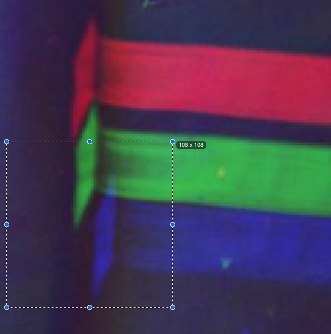

Happy Valentine's Day everyone. A little background on this photo collection and an overview of what this post is about (taken from course homepage):

<h2 id="background">Background</h2>
<p><a href="http://en.wikipedia.org/wiki/Prokudin-Gorskii">Sergei Mikhailovich Prokudin-Gorskii</a> (1863-1944) [Сергей Михайлович Прокудин-Горский, to his Russian friends] was a man well ahead of his time. Convinced, as early as 1907, that color photography was the wave of the future, he won Tzar’s special permission to travel across the vast Russian Empire and take color photographs of everything he saw including the only color portrait of <a href="http://en.wikipedia.org/wiki/Leo_Tolstoy">Leo Tolstoy</a>. And he really photographed everything: people, buildings, landscapes, railroads, bridges… thousands of color pictures! His idea was simple: record three exposures of every scene onto a glass plate using a red, a green and a blue filter. Never mind that there was no way to print color photographs until much later – he envisioned special projectors to be installed in “multimedia” classrooms all across Russia where the children would be able to learn about their vast country. Alas, his plans never materialized: he left Russia in 1918, right after the revolution, never to return again. Luckily, his RGB glass plate negatives, capturing the last years of the Russian Empire, survived and were purchased in 1948 by the Library of Congress. The LoC has recently digitized the negatives and made them available on-line.</p>

<h2 id="overview">Overview</h2>
<p>The goal of this assignment is to take the digitized Prokudin-Gorskii glass plate images and, using image processing techniques, automatically produce a color image with as few visual artifacts as possible. In order to do this, you will need to extract the three color channel images, place them on top of each other, and align them so that they form a single RGB color image. A cool explanation on how the Library of Congress created the color images on their site is available <a href="http://www.loc.gov/exhibits/empire/making.html">here</a>.</p>


## Stacking
{:width="384"}
The simplest approach to this problem is splitting the image into three equal parts and layering each part as a separate channel. The "dumb" stacking approach is a single line of code but it already outputs something that looks pretty cool.

```py
def dumb_stack(r,g,b):
    return np.dstack([r, g, b])
```


## Problem: Alignment

### Shifting artifacts

We see shifts as patches of strong RGB (bright spots) or strong CMY (dark spots). For example, in `three_generations`, hats have shifted patches with strong yellow at the bottom, strong magenta in the middle, and strong cyan at the top. This is due to the hat being a dark region. Since the surrounding is very bright, a dark patch in the blue channel leads to a relatively bright red and green pixel that shows up as a yellow patch.
{: width="384" }

On the other hand, the belt is brighter and shows strong red, green, blue patches. 
{: width="384" }

### Search space
{:width="450"}
The screenshot shows me measuring the vertical displacement between the red and blue channel. From this eyeball measurement, I decided I'll search over a 160x160 space of possible shifts to align each channel. However, this leads to (10 images) x (2 channel pairs) x (160x160 displacements) = 512,000, which is a little too much. For now, I'll scale down the images by a factor of four and make it more manageable and only search over 40x40 displacements.

## Solution
### SSD
SSD gives reasonable results. 
Best Results:
Cathedral
Three generations
icon

Some failure cases:
harvesters

### NCC
NCC doesn't really change a lot for emir and for turkman. I will look at other images and see if there is a big improvement.
It took 5.5 minutes for the entire set of the default images.

### Bells & Whistles: Letterbox

Notice that the edges ("letterbox") are aligned very well. Because the letterbox is so prominent (ie. high contrast/clarity from surrounding areas), properly aligning the letterbox gives the algorithms a good score. 

#### Manual Cropping
I added a manual crop of 10% from each side and kept the 80% as input to the alignment algorithms. We can see that horizontal alignment has improved a lot, but vertical alignment seems similar. The effect is demonstrated well in `train`

{: width="384" } {: width="384" }

#### Automatic Cropping

#### Mirroring at the edge
I've used `np.roll` to maintain the shape of the channels, but the problem with this is that it wraps the edges around to the other side.
`np.pad` has modes `reflect` and `symmetric`.


### Bells & Whistles: Analyzing SSD of `harvesters`
In the background of this image are several rows of bushes that have repeating texture. My hypothesis is that the SSD will have a repeating patter too.

---
Instructions:
  <header class="post-header">
    <p class="post-meta">Released on Monday 01/30/2023</p>
    

  </header>

  <div>
    
    <span style="font-weight: bold">Due Date: Wednesday 02/15/2023 23:59</span>
    
    <p style="font-weight: bold">Download:
      
      
      [<a href="/sp23/static_files/assignments/hw1/16726_s23_hw1-main.zip">attachment</a>]
      
      
    </p>

    
    <div style="color: gray;">
      <h3>Late Policy</h3>
      <ul>
    
    <li>You have free 5 late days.</li>
    
    <li>You can use late days for assignments. A late day extends the deadline 24 hours.</li>
    
    <li>Once you have used all 5 late days, the penalty is 10% for each additional late day.</li>
    
</ul>
    </div>
    
  </div>

  <br />
  <article class="post-content">

<!-- ## Award Winners!
We've completed the homework, grading, and voting, and the winner of our best assignment is [Riyaz Panjwani](https://www.andrew.cmu.edu/course/16-726-sp23/projects/rpanjwan/proj1/)!

Honorable Mentions go to [Harry Freeman](https://www.andrew.cmu.edu/course/16-726-sp23/projects/hfreeman/proj1/). Great work to all and check out the winning projects! -->


<p>Some starter code is available in <a href="http://www.andrew.cmu.edu/course/16-726/projects/handout/proj1/main_hw1.py">Python</a>; do not feel compelled to use it. We will assume that a simple x,y translation model is sufficient for proper alignment. However, the full-size glass plate images are very large, so your alignment procedure will need to be relatively fast and efficient.</p>

<h2 id="details">Details</h2>
<p>A few of the digitized glass plate images (both hi-res and low-res versions) will be placed in the following directory (note that the filter order from top to bottom is BGR, not RGB!): <a href="http://www.andrew.cmu.edu/course/16-726/projects/handout/proj1/data/"><code class="language-plaintext highlighter-rouge">data/</code></a>. You can also get the data by running <code class="language-plaintext highlighter-rouge">bash download_data.sh</code> from the attachment, or directly download from <a href="http://www.andrew.cmu.edu/course/16-726-sp23/projects/handouts/proj1/data.zip">here</a>.</p>

<p>Your program will take a glass plate image as input and produce a single color image as output. The program should divide the image into three equal parts and align the second and the third parts (G and R) to the first (B). For each image, you will need to print the (x,y) displacement vector that was used to align the parts.</p>

<p>The easiest way to align the parts is to exhaustively search over a window of possible displacements (say [-15,15] pixels), score each one using some image matching metric, and take the displacement with the best score. There is a number of possible metrics that one could use to score how well the images match. The simplest one is just the L2 norm also known as the Sum of Squared Differences (SSD) distance which is simply sum(sum((image1-image2).^2)) where the sum is taken over the pixel values. Another is normalized cross-correlation (NCC), which is simply a dot product between two normalized vectors: (<code class="language-plaintext highlighter-rouge">image1./||image1||</code> and <code class="language-plaintext highlighter-rouge">image2./||image2||</code>). Note that in the case of the Emir of Bukhara (show on right), the images to be matched do not actually have the same brightness values (they are different color channels), so you might have to use a cleverer metric, or different features than the raw pixels.</p>

<p>Exhaustive search will become prohibitively expensive if the pixel displacement is too large (which will be the case for high-resolution glass plate scans). In this case, you will need to implement a faster search procedure such as an image pyramid. An image pyramid represents the image at multiple scales (usually scaled by a factor of 2) and the processing is done sequentially starting from the coarsest scale (smallest image) and going down the pyramid, updating your estimate as you go. It is very easy to implement by adding recursive calls to your original single-scale implementation.</p>

<p>Your job will be to implement an algorithm that, given a 3-channel image, produces a color image as output. Implement a simple single-scale version first, using for loops, searching over a user-specified window of displacements. You should use the smaller .jpg image (<code class="language-plaintext highlighter-rouge">cathedral.jpg</code>) in the directory to test this version of the code. Next, add a coarse-to-fine pyramid speedup to handle large images like the .tiff ones provided in the directory.</p>

<p>Additional details for the implementations.</p>
<div class="language-plaintext highlighter-rouge"><div class="highlight"><pre class="highlight"><code># functions allowed
np.mean
np.linalg.norm
cv2.resize
PIL.Image.resize
skimage.transform.resize
scipy.misc.imresize
np.roll
scipy.ndimage.interpolation.shift
np.random.choice
any PyTorch function equivalent to the above

# functions not allowed (unlikely you'll need it anyways)
np.fft
scipy.ndimage.convolve
scipy.signal.convolve2d
</code></pre></div></div>
<p>You’re allowed to use <em>any</em> functions for <strong>Bells &amp; Whistles</strong>.</p>

<h2 id="submission">Submission</h2>
<p>Please submit both your code (to Canvas) and a project webpage (to AFS). A general guideline could be found in <a href="/sp23/assignments/hw0">Assignment #0</a>.</p>

<p><strong>You do not need to include images in the code submission.</strong> You only need to include images in your webpage.</p>

<p>To submit the webpage, the project folder <code class="language-plaintext highlighter-rouge">andrewid_web_projX</code> containing an <code class="language-plaintext highlighter-rouge">index.html</code> web page file should include the following:</p>
<ul>
  <li>Text giving a brief overview of the project, and text describing your approach. If you ran into problems on images, describe how you tried to solve them. The website does not need to be pretty; you just need to explain what you did.</li>
  <li>The result of your algorithm on all of our example images. List the offsets you calculated. Do not turn in the large .tiff images. Your web page should only display compressed images (e.g. jpg or png or gif if you want to animate something).</li>
  <li>The result of your algorithm on a few examples of your own choosing, downloaded from the Prokudin-Gorskii collection.</li>
  <li>If your algorithm failed to align any image, provide a brief explanation of why.</li>
  <li>Describe any bells and whistles you implemented. For maximum credit, show before and after images.</li>
  <li>Remember not to use any absolute links to images etc on your computer, as these will not work online. Only use relative links within your folder.</li>
  <li><strong>Output all of your images to jpg, it’ll save you a lot of disk space</strong>. This will make your website faster to load as well.</li>
</ul>

<h2 id="bells--whistles-extra-credit">Bells &amp; Whistles (Extra Credit)</h2>

<p>Although the color images resulting from this automatic procedure will often look strikingly real, they are still a far cry from the manually restored versions available on the LoC website and from other professional photographers. Of course, each such photograph takes days of painstaking Photoshop work, adjusting the color levels, removing the blemishes, adding contrast, etc. Can we make some of these adjustments automatically, without the human in the loop? Feel free to come up with your own approaches or talk to me about your ideas. There is no right answer here – just try out things and see what works. For example, the borders of the photograph will have strange colors since the three channels won’t exactly align. See if you can devise an automatic way of cropping the border to get rid of the bad stuff. One possible idea is that the information in the good parts of the image generally agrees across the color channels, whereas at borders it does not.</p>

<p>Here are some ideas, but we will give credit for other clever ideas:</p>

<ul>
  <li>Up to 2 pts: Pytorch implementation. Pytorch tensor is very similar to numpy array. Try to implement the alignment, rescale, stacking, everything you need in pytorch except for image IO. It is a good practice to get familiar with pytorch used in the upcoming assignments.</li>
  <li>Up to 2 pts: Automatic cropping. Remove white, black or other color borders. Don’t just crop a predefined margin off of each side – actually try to detect the borders or the edge between the border and the image.</li>
  <li>Up to 2 pts: Automatic contrasting. It is usually safe to rescale image intensities such that the darkest pixel is zero (on its darkest color channel) and the brightest pixel is 1 (on its brightest color channel). More drastic or non-linear mappings may improve perceived image quality.</li>
  <li>Up to 3 pts: Automatic white balance. This involves two problems – 1) estimating the illuminant and 2) manipulating the colors to counteract the illuminant and simulate a neutral illuminant. Step 1 is difficult in general, while step 2 is simple (see the Wikipedia page on <a href="http://en.wikipedia.org/wiki/Color_balance">Color Balance</a> and section 2.3.2 in the Szeliski book). There exist some simple algorithms for step 1, which don’t necessarily work well – assume that the average color or the brightest color is the illuminant and shift those to gray or white.</li>
  <li>Up to 2 pts: Better color mapping. There is no reason to assume (as we have) that the red, green, and blue lenses used by Produkin-Gorskii correspond directly to the R, G, and B channels in RGB color space. Try to find a mapping that produces more realistic colors (and perhaps makes the automatic white balancing less necessary).</li>
  <li>Up to 2 pts: Better features. Instead of aligning based on RGB similarity, try using gradients or edges.</li>
  <li>Up to 3 pts: Better transformations. Instead of searching for the best x and y translation, additionally search over small scale changes and rotations. Adding two more dimensions to your search will slow things down, but the same course to fine progression should help alleviate this.</li>
  <li>Up to 2 pts: Aligning and processing data from other sources. In many domains, such as astronomy, image data is still captured one channel at a time. Often the channels don’t correspond to visible light, but NASA artists stack these channels together to create false color images. For example, here is a <a href="http://www.wikihow.com/Process-Your-Own-Colour-Images-from-Hubble-Data">tutorial</a> on how to process Hubble Space Telescope imagery yourself. Also, consider images like this one of a <a href="http://www.flickr.com/photos/gsfc/7931831962/in/set-72157631408160534">coronal mass ejection</a> built by combining <a href="http://www.nasa.gov/mission_pages/sunearth/news/News090412-filament.html">ultraviolet images</a> from the Solar Dynamics Observatory. To get full credit for this, you need to demonstrate that your algorithm found a non-trivial alignment and color correction.</li>
</ul>

<p>For all extra credit, be sure to demonstrate on your web page cases where your extra credit has improved image quality.</p>

<h2 id="final-advice">Final Advice</h2>
<ul>
  <li>For the main assignment, you need to implement almost everything from scratch (except the functions for reading, writing, resizing, shifting and displaying images: e.g. imresize, scipy.ndimage.shift, np.roll, etc.). In particular, you are not allowed to use high level functions, such as these for constructing Laplacian/Gaussian pyramids, automatically aligning images, etc. If in doubt, ask on piazza.</li>
  <li>The average running time is expected to be less than 1 minute per image. If it takes hours for your program to finish, you should further optimize the code. This is true both the NumPy and PyTorch implementation!</li>
  <li>Try to vectorize/parallelize your code, and avoid using too many FOR loops. (See more details for <a href="https://wiki.python.org/moin/PythonSpeed/PerformanceTips#Loops">Python</a>)</li>
  <li>For all projects, don’t get bogged down tweaking input parameters. Most, but not all images will line up using the same parameters. Your final results should be the product of a fixed set of parameters (if you have free parameters). Don’t worry if one or two of the handout images don’t align properly using the simpler metrics suggested here.</li>
  <li>The borders of the images will probably hurt your results, try computing your metric on the internal pixels only.</li>
  <li>Again, output all of your images to jpg, it’ll save you a lot of disk space.</li>
</ul>

<p>This assignment will be graded out of 100 points, as follows:</p>

<ul>
  <li>60 points for a single-scale implementation with successful results on low-res images.</li>
  <li>40 points for a multiscale pyramid version that works on the large images.</li>
  <li>Up to 5 points for bells &amp; whistles explicitly mentioned above.</li>
  <li>Up to 5 points for bells &amp; whistles you come up with on your own (and OK with course staff).</li>
</ul>

<p><strong>Acknowledgement</strong>:
The assignment is credit to <a href="https://inst.eecs.berkeley.edu/~cs194-26/fa18/hw/proj1/">Berkeley CS194-26</a></p>

  </article>

