Happy Valentine's Day everyone. A little background on this photo collection and an overview of what this post is about (taken from course homepage):

<h2 id="background">Background</h2>

<a href="http://en.wikipedia.org/wiki/Prokudin-Gorskii">Sergei Mikhailovich Prokudin-Gorskii</a> (1863-1944) [Сергей Михайлович Прокудин-Горский, to his Russian friends] was a man well ahead of his time. Convinced, as early as 1907, that color photography was the wave of the future, he won Tzar’s special permission to travel across the vast Russian Empire and take color photographs of everything he saw including the only color portrait of <a href="http://en.wikipedia.org/wiki/Leo_Tolstoy">Leo Tolstoy</a>. And he really photographed everything: people, buildings, landscapes, railroads, bridges… thousands of color pictures! His idea was simple: record three exposures of every scene onto a glass plate using a red, a green and a blue filter. Never mind that there was no way to print color photographs until much later – he envisioned special projectors to be installed in “multimedia” classrooms all across Russia where the children would be able to learn about their vast country. Alas, his plans never materialized: he left Russia in 1918, right after the revolution, never to return again. Luckily, his RGB glass plate negatives, capturing the last years of the Russian Empire, survived and were purchased in 1948 by the Library of Congress. The LoC has recently digitized the negatives and made them available on-line.

<h2 id="overview">Overview</h2>

The goal of this assignment is to take the digitized Prokudin-Gorskii glass plate images and, using image processing techniques, automatically produce a color image with as few visual artifacts as possible. In order to do this, you will need to extract the three color channel images, place them on top of each other, and align them so that they form a single RGB color image. A cool explanation on how the Library of Congress created the color images on their site is available <a href="http://www.loc.gov/exhibits/empire/making.html">here</a>.

## Stacking
{:width="384"}
The simplest approach to this problem is splitting the image into three equal parts and layering each part as a separate channel. The "dumb" stacking approach is a single line of code but it already outputs something that looks pretty cool.

## Problem: Alignment

### Shifting artifacts

We see shifts as patches of strong RGB (bright spots) or strong CMY (dark spots). For example, in `three_generations`, hats have shifted patches with strong yellow at the bottom, strong magenta in the middle, and strong cyan at the top. This is due to the hat being a dark region. Since the surrounding is very bright, a dark patch in the blue channel leads to a relatively bright red and green pixel that shows up as a yellow patch.
{: width="384" }

On the other hand, the belt is brighter and shows strong red, green, blue patches. 
{: width="384" }

### Search space
{:width="450"}
The screenshot shows me measuring the vertical displacement between the red and blue channel. From this eyeball measurement, I decided I'll search over a 160x160 space of possible shifts to align each channel. However, this leads to (10 images) x (2 channel pairs) x (160x160 displacements) = 512,000, which is a little too much. For now, I'll scale down the images by a factor of four and make it more manageable and only search over 40x40 displacements.

## Solution
### SSD
Using this method, SSD already gives reasonable results. Examples: `Cathedral` and `Three Generations`

Dumb Stacking:
{: width="384" }
{: width="384" }

SSD:
{: width="384" }
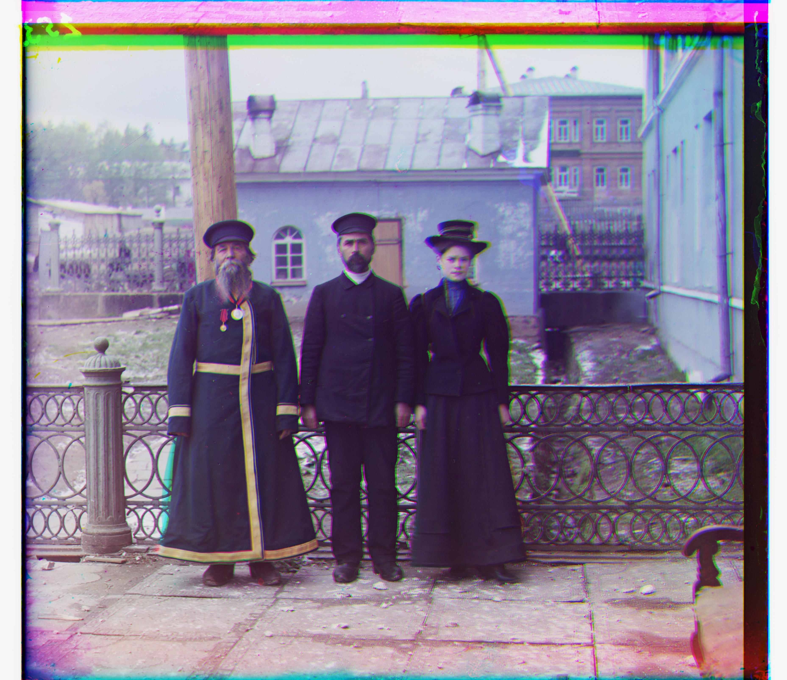{: width="384" }

A failure case is with `Harvesters` where the iterating pattern of the bushes seem to have matched up well but not in other areas. It would be interesting to see if that area has a very low SSD score.
{: width="384" }

### NCC
NCC works slightly better than SSD across most images. 

Dumb stack:
{: width="384" }
SSD:
{: width="384" }
NCC:
{: width="384" }

### Image Pyramid 
Using image pyramids I was able to search a larger space but faster using coarse-to-fine strategy. Combined with cropping, to search across the same space, it takes only about 10% of the time it requires without the image pyramid.

#### Image Pyramid Height
Depending on the height/depth of the image pyramid, the high resolution features can get blurred out too much and finds a bad starting point. With a bad starting point, the coarse-to-fine strategy can get stuck at a local minimum. Since the image sizes differed, I used a log function to set the minimum image size to be around 16~32 pixels.

An extension of this method could also consider average local variability. We can stop downsampling when a target lower bound on the local variability is reached. 

### Letterbox

Notice that the edges ("letterbox") are aligned very well. Because the letterbox is so prominent (ie. high contrast/clarity from surrounding areas), properly aligning the letterbox gives the algorithms a good score. 

#### Manual Cropping
I added a manual crop of 10% from each side and kept the 80% as input to the alignment algorithms, to get rid of the effect of the borders. We can see that horizontal alignment has improved a lot, but vertical alignment seems similar. The effect is demonstrated well in `train`

Without cropping before input into algorithm:
{: width="384" } 
With cropping before input into algorithm:
{: width="384" }

I kept reducing the crop factor all the way down to 5%, using only the data in the center of the image to align the channels. The result is a huge speed up and for some images like `Emir`, this works well because incidentally the center pixels were best for aligning. However, for some images like `Lady`, the center pixels lack detail and needed a larger window of at least 15% crop factor to achieve good results.

#### Mirroring at the edge
I've used `np.roll` to maintain the shape of the channels, but the problem with this is that it wraps the edges around to the other side. Edges on different ends of the image may differ greatly in value. This means that the images might be harshly penalized if the frame needs to wrap around. 

To mitigate this possibility, instead of rolling pixels over when shifting the window, I used symmetric padding to 'extend' the image rather than wrap it around. (`np.pad` has modes `reflect` and `symmetric`). However, this did not result in better outcomes. It fails miserably in some cases, wrapping around almost halfway. Perhaps the pixels were now too similar to each other that it was hard to find a sensible minimum score. 

### Final Results
#### NCC, Image Pyramid depth of 3, Crop factor of 0.6
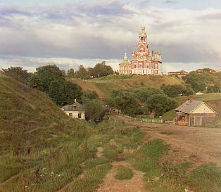 
☝ `cathedral 			r_shift=[ 12,  3]	g_shift=[ 5,  2]`

#### NCC, Image Pyramid depth of 8, Crop factor of 0.6
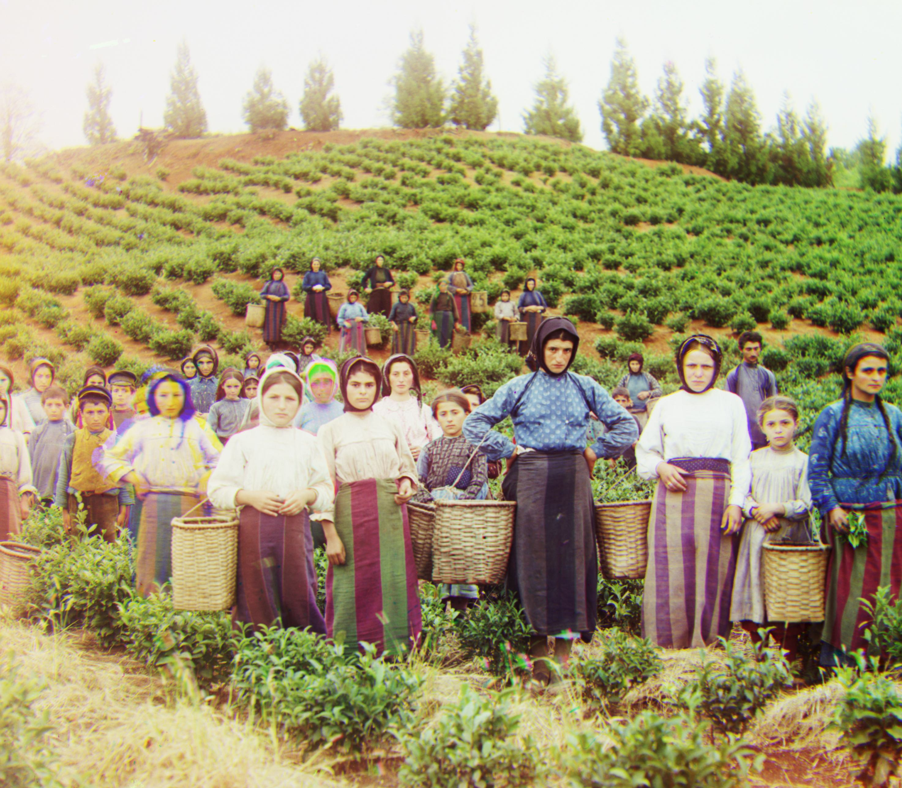 
☝ `harvesters  		r_shift=[123, 14]	g_shift=[59, 17]`
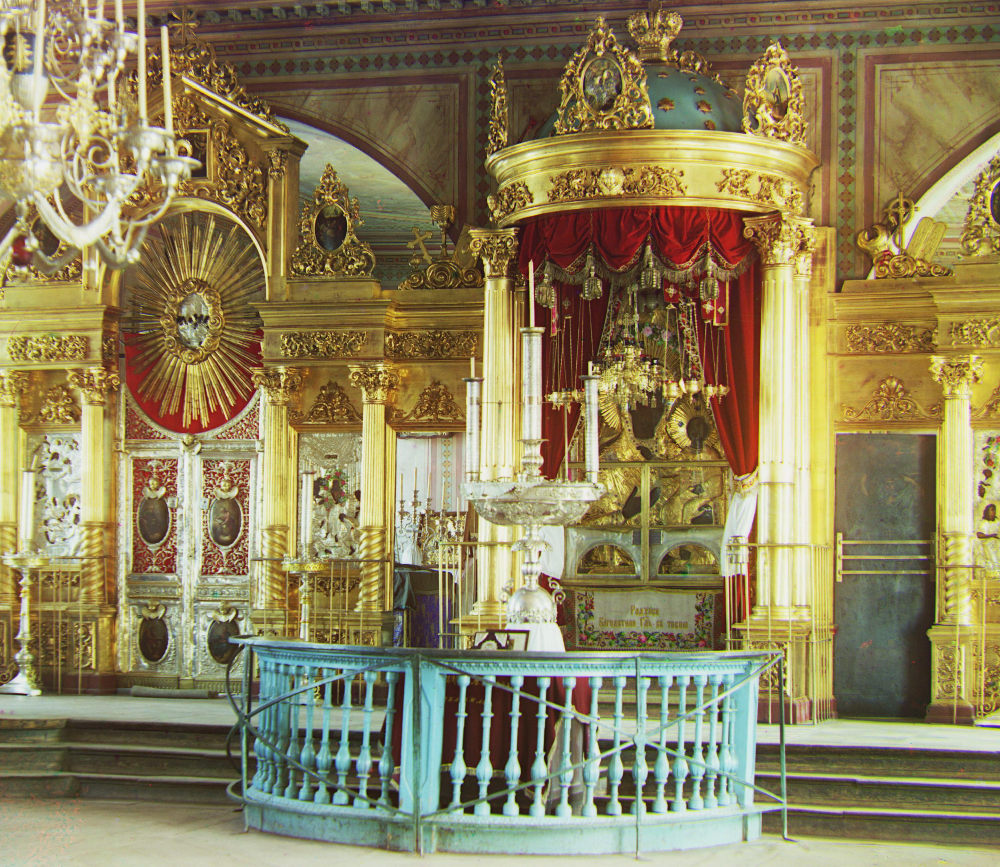 
☝ `icon  				r_shift=[ 89, 23]	g_shift=[40, 17]`
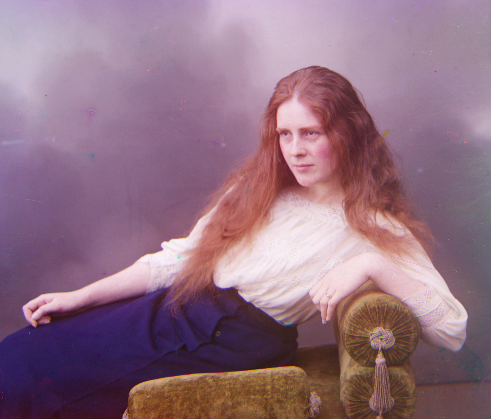 
☝ `lady  				r_shift=[109, 11]	g_shift=[49,  8]`
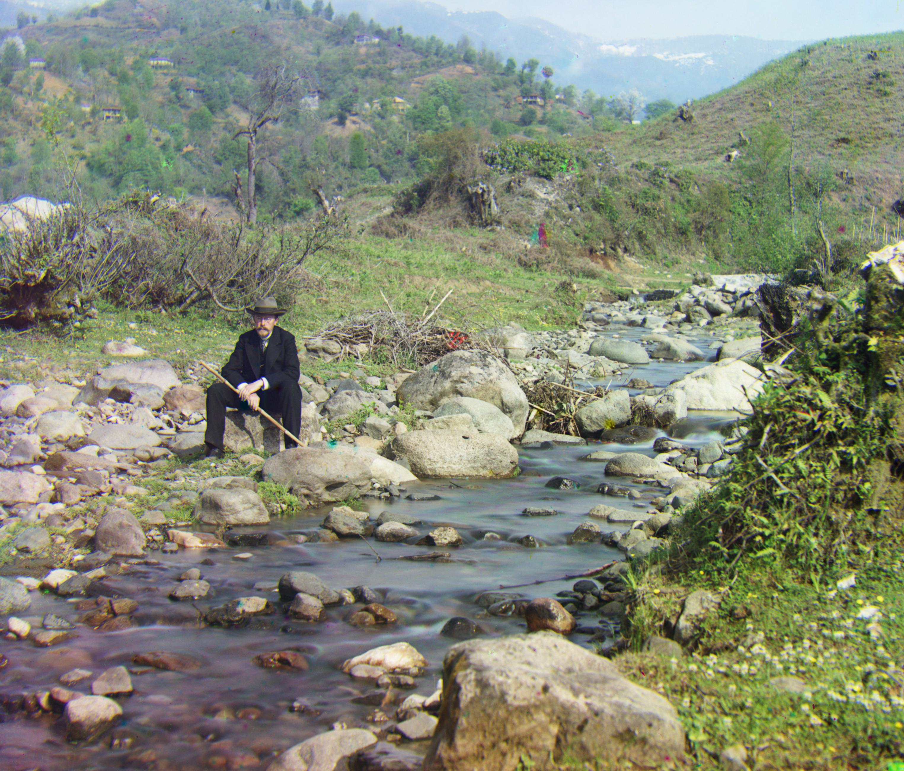 
☝ `self_portrait  	r_shift=[176, 37]	g_shift=[78, 29]`
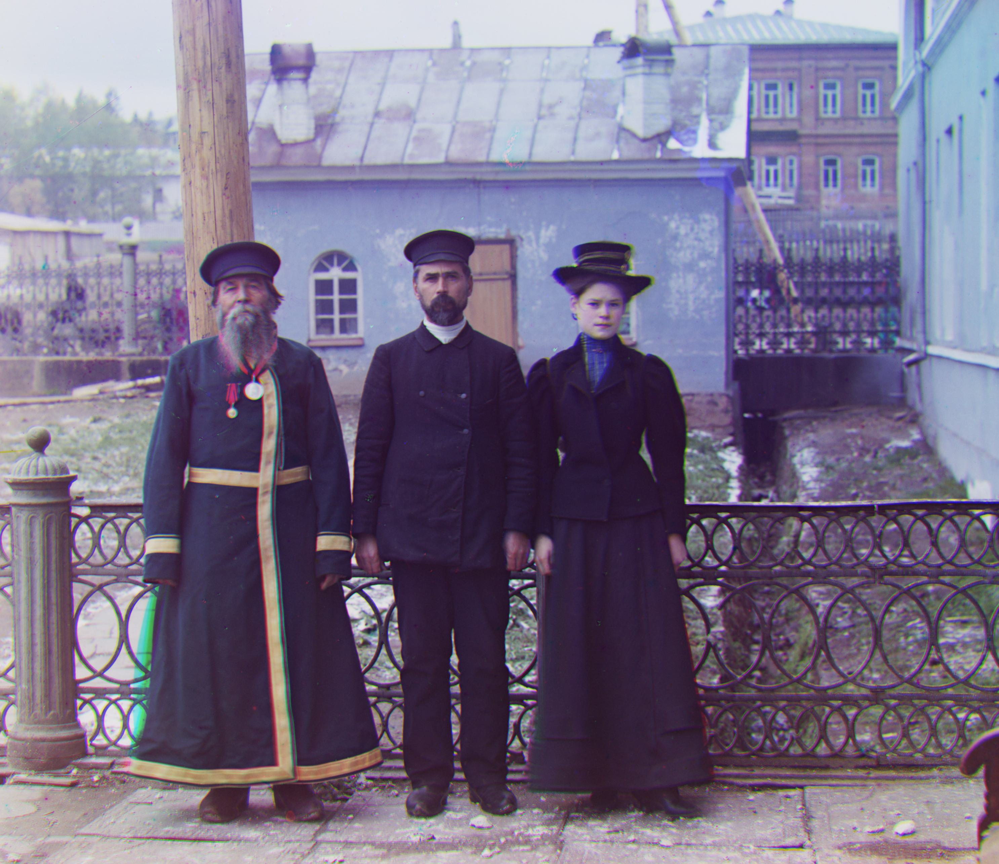 
☝ `three_generations  r_shift=[110, 12]	g_shift=[50, 14]`
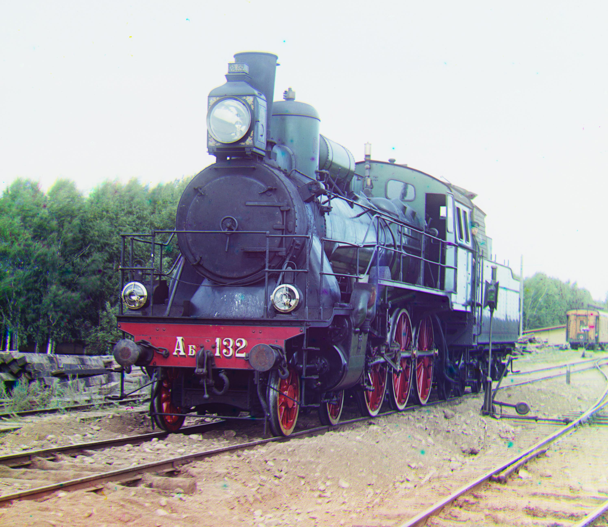 
☝ `train  			r_shift=[ 87, 32]	g_shift=[42,  6]`
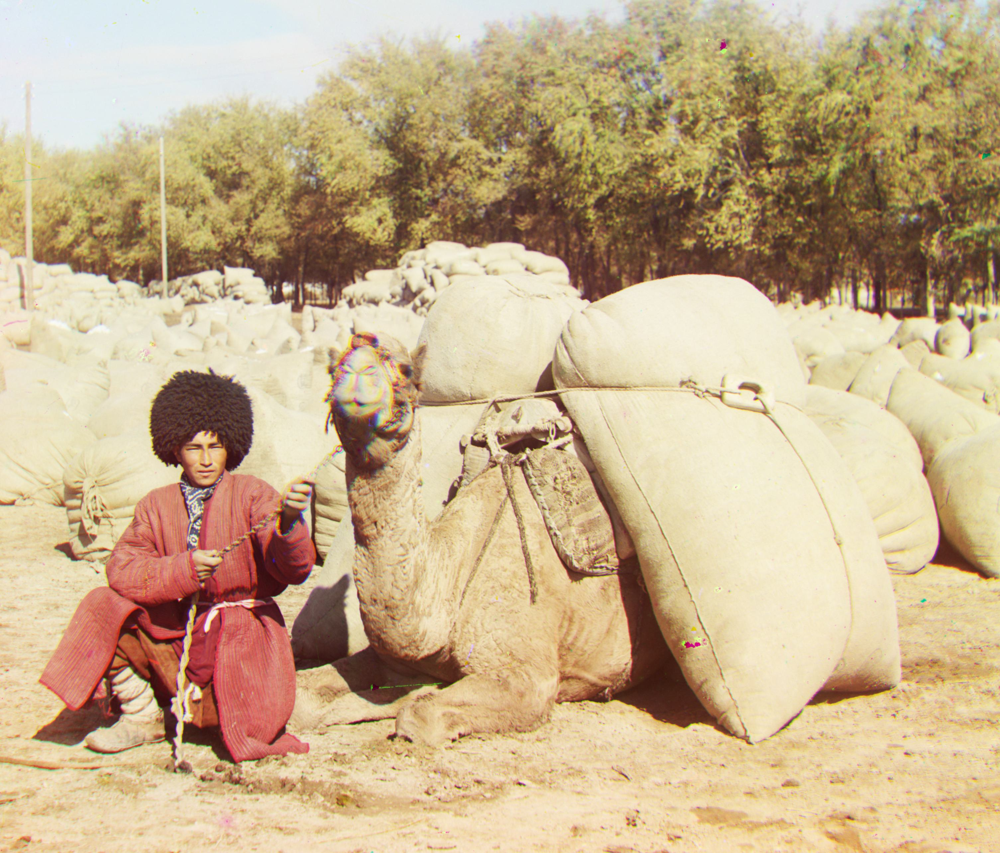 
☝ `turkmen  			r_shift=[116, 28]	g_shift=[55, 20]`

#### NCC, Image Pyramid depth of 8, Crop factor of 0.1
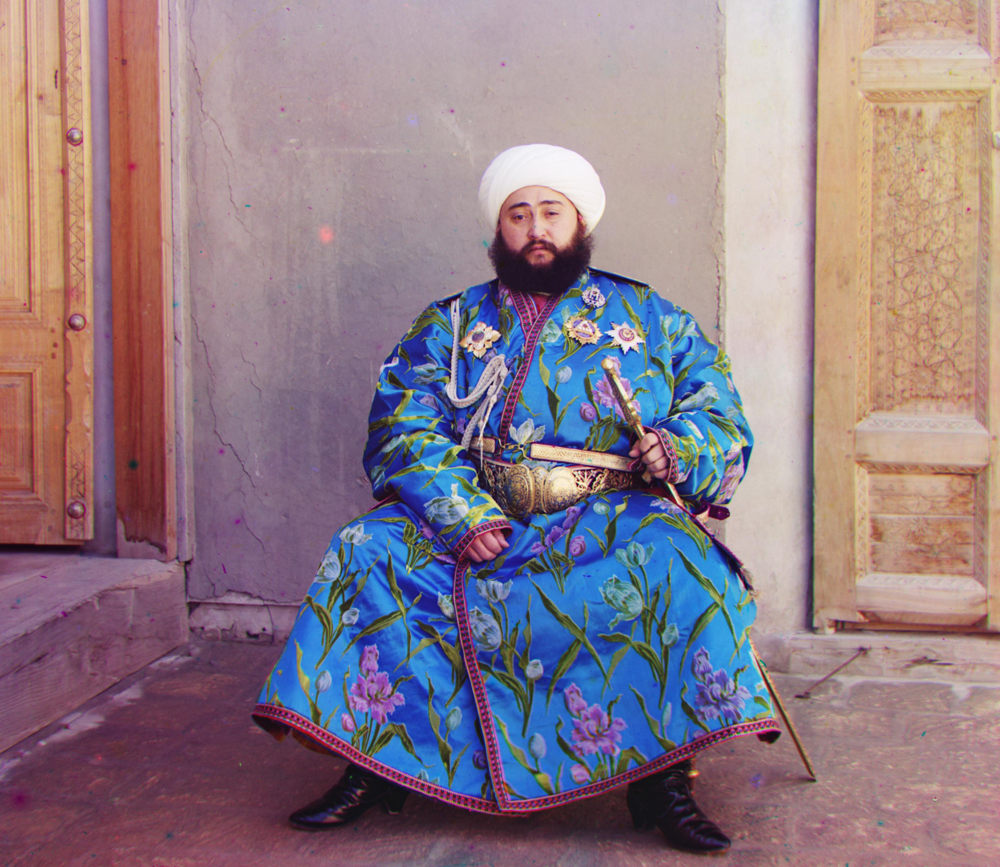 
☝ `emir				r_shift=[105, 41]	g_shift=[48, 23]`
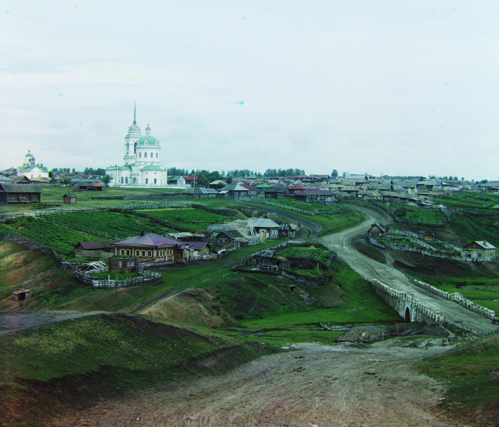
☝ `village			r_shift=[137, 23]	g_shift=[64, 13]`